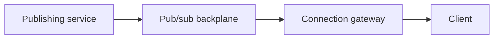

# Realtime delivery

Realtime here means a client learns about a new fact without waiting for the next user action. The fact still has a durable home, usually a database or a log. The connection is a cache of "who is listening," not the system of record. [Webhooks](webhooks.md) are the same idea when the receiver is another server with a URL. This page is browsers, apps, and the tier that holds their connections.

## Decide

| Transport | Use when | Avoid when |
|---|---|---|
| WebSocket ([RFC 6455](https://www.rfc-editor.org/rfc/rfc6455)) | The client and the server both send messages on one long-lived connection | You only push server-to-client text and would rather stay on ordinary HTTP |
| Server-Sent Events | The server pushes text and the client reconnects with `Last-Event-ID`. The [HTML standard](https://html.spec.whatwg.org/multipage/server-sent-events.html) defines the event stream and that header | You need client-to-server frames on the same connection, or binary frames |
| Long polling | A proxy in the path still breaks WebSocket and SSE | You can hold SSE or WebSocket. Polling spends a request per hold interval even when nothing happened |
| Mobile push ([APNs](https://developer.apple.com/documentation/usernotifications/sending-notification-requests-to-apns), [FCM](https://firebase.google.com/docs/cloud-messaging)) | The app is suspended and only the OS can wake it | You need an ordered in-app log. Push is a hint to open the app and catch up. Delivery is best-effort |
| WebTransport | You have checked current browser and non-browser support and you need streams or datagrams on HTTP/3 | It is your default public API. The [W3C TR](https://www.w3.org/TR/webtransport/) is a Candidate Recommendation Snapshot, not a Recommendation. See [publication history](https://www.w3.org/standards/history/webtransport) |

## Fan-out

Clients connect to a gateway tier. Each gateway owns the sockets on that node and subscribes, on a pub/sub backplane, only to channels that have a local subscriber. A publisher writes the event once to the backplane. It does not know which process holds which socket.



The gateway is a [load-balanced](../../patterns/load-balancing.md) set of sticky connections: a message for a connection must arrive at the node that holds it, which is what the backplane subscription is for. Do not pin users to a node in the load balancer and also forget to subscribe. Do not broadcast every event to every gateway.

Presence is a soft view of those sockets. The gateway refreshes a session row with a TTL. If the refresh stops, the row expires. Presence is late by that TTL. Do not use it as authorization. A user can be connected and forbidden, or disconnected and still allowed.

## Slow consumers, order, and resume

Each connection has its own outbound buffer with a cap. When the cap is hit, drop, coalesce to the latest state, or disconnect that client. Do not let one TCP window stall the loop that serves the other subscribers on the node. That stall is how one stuck phone becomes a missed SLO. [Load shedding](../reliability/load-shedding.md) is the same pressure at the request layer. [Rate limiting](rate-limiting.md) still applies to how many subscriptions one tenant may open.

Bytes on one TCP connection arrive in order. Across a reconnect you deliver at least once: the client dedupes on an event id. Order inside one channel holds if a single logical publisher sequences that channel. There is no total order across channels. Say that in the API.

Reconnect with exponential backoff and full jitter, as in [retries](../reliability/retries-timeouts.md) and [retry with backoff](../../patterns/retry-with-backoff.md). SSE sends `Last-Event-ID` on the reconnect. WebSockets have no equivalent header. Put a resume token in the first application message. The gateway replays from a short buffer. If the token is older than the buffer, the client discards local tail state and loads a snapshot. Do not pretend the buffer is infinite.

## Auth and idle timeouts

Authenticate at the upgrade or at the first request, with the same token rules as [OIDC](../identity/oidc-oauth2.md). A long-lived socket outlives the access token. Track the expiry on the connection. When it passes, close with a documented application signal that means "refresh and resume," which is different from a network drop the client should back off. A token in a query string lands in access logs. Prefer a cookie or the first message after the upgrade.

Proxies close idle connections. Send a WebSocket ping or an SSE comment on a fixed interval, and set every idle timeout on the path (load balancer, mesh, gateway) to at least three times that interval. With a 20-second ping:

```text
Idle timeout >= 3 * 20 s = 60 s
```

Two delayed pings then still fit inside the idle window. A timeout of 60 seconds with a 60-second ping drops healthy connections that were quiet for one interval.

## Capacity

Planning assumptions for one gateway: 50,000 connections, 32 KiB of buffers and connection state each, 1,000 events/s that this node must fan out, 30 local subscribers per event, 512-byte payloads. The 1 Gbit/s figure is the payload budget you assign this traffic, not a NIC datasheet.

```text
Memory = 50,000 * 32 KiB = 1,600,000 KiB = 1,562.5 MiB

File descriptors ≈ 50,000 sockets + 500 for the backplane and health
                 = 50,500

Outbound messages = 1,000 * 30 = 30,000 messages/s
Outbound bytes    = 30,000 * 512 = 15,360,000 bytes/s
Outbound bits     = 15,360,000 * 8 = 122,880,000 bit/s = 122.88 Mbit/s

Share of a 1 Gbit/s payload budget = 122.88 / 1,000 = 0.123 = 12.3%
```

At 12% of that budget the NIC is not the limit. Per-connection memory, file descriptors, and the CPU to write 30,000 frames/s are the limits to measure. Heartbeats add steady traffic even when the product is quiet:

```text
50,000 connections / 20 s = 2,500 pings/s
```

plus the pongs. Small next to 30,000 data messages/s, and enough to matter for wakeups.

Long polling does not remove the connection count. It adds a request rate. The same 50,000 clients, each holding for 25 seconds and reconnecting immediately:

```text
50,000 / 25 = 2,000 requests/s
```

before any real event. That is why polling is the fallback, not the design.

If every event were forwarded to all gateways and you had 20 gateways, the backplane would carry `1,000 * 20 = 20,000` event copies/s even when a gateway has no subscriber. Subscribe at the gateway so a node receives the 1,000/s in the example only for channels it actually serves.

## Checklist

- [ ] The transport matches who sends. SSE is not forced into a WebSocket, and push is not treated as a log.
- [ ] Publishers do not address sockets. Gateways subscribe for local listeners.
- [ ] Each connection has a bounded send buffer and a defined overflow behavior.
- [ ] Reconnect uses backoff, jitter, and a resume token or `Last-Event-ID`, plus a snapshot when the token is stale.
- [ ] Token expiry closes the socket with a refresh signal. Idle timeouts are at least three ping intervals.
- [ ] The capacity note shows connections, bytes of state, and fan-out messages/s for one node.

## Anti-patterns

- One process holding every connection, with the publisher looping over an in-memory map on a different machine by RPC to all nodes.
- A shared outbound queue so one slow client blocks the channel.
- Reconnect storms: immediate retry, no jitter, no server-side cap.
- Assuming WebSocket frames are exactly-once across a dropped connection.
- Leaving the access token unchecked until the next Tuesday because the socket stayed open.
- A load-balancer idle timeout shorter than the ping interval.
- Using a push notification as the only copy of a payment event.

## Related

- [Webhooks](webhooks.md), [gateways](gateways.md), [rate limiting](rate-limiting.md), [async HTTP](errors-pagination-async.md)
- [Retries](../reliability/retries-timeouts.md), [load shedding](../reliability/load-shedding.md), [OIDC](../identity/oidc-oauth2.md)
- [Retry with backoff](../../patterns/retry-with-backoff.md), [load balancing](../../patterns/load-balancing.md)

## Sources

- [RFC 6455, The WebSocket Protocol](https://www.rfc-editor.org/rfc/rfc6455)
- [HTML, Server-sent events](https://html.spec.whatwg.org/multipage/server-sent-events.html)
- [WebTransport (W3C TR)](https://www.w3.org/TR/webtransport/), [publication history](https://www.w3.org/standards/history/webtransport)
- [Sending notification requests to APNs](https://developer.apple.com/documentation/usernotifications/sending-notification-requests-to-apns)
- [Firebase Cloud Messaging](https://firebase.google.com/docs/cloud-messaging)
