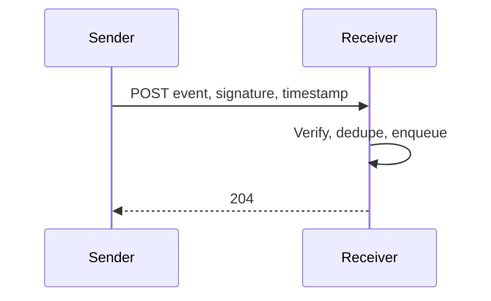

# Webhooks

A webhook is an HTTP callback to a URL the receiver controls. You are the client. Their endpoint will be slow, wrong, and occasionally hostile. Design for that.

## Defaults

- The receiver registers an HTTPS URL and a secret per endpoint. Sign the webhook id, the unix timestamp, and the raw body, in that order, separated by periods, with HMAC-SHA256. Send `webhook-id`, `webhook-timestamp`, and `webhook-signature`. Receivers reject timestamps outside a small window (about five minutes), compare signatures in constant time, and treat the id as the dedupe key. That is the [Standard Webhooks](https://www.standardwebhooks.com/) symmetric scheme. The specification is in the [standard-webhooks repository](https://github.com/standard-webhooks/standard-webhooks). This page does not copy it.
- Rotate secrets by accepting two secrets during overlap.
- Each event has a stable id. Receivers store it and ignore duplicates. Your delivery is at-least-once.
- Respond `2xx` quickly means "I durably accepted it," not "I finished the business process." Receivers enqueue and return. You treat non-`2xx` and timeouts as failures.
- Retry with exponential backoff and jitter, cap the attempts (for example a day of trying), then disable or dead-letter the endpoint and tell the owner. Do not retry forever at full speed.
- Timeouts on your side are short (a few seconds). A slow receiver must not occupy your delivery workers without a bound. Isolate endpoints so one bad URL does not block every other customer. See [bulkhead](../../patterns/bulkhead.md).
- The body is a versioned event, small, without secrets. Include a link or an id the receiver can call back to fetch, if the payload would otherwise be huge or sensitive.
- mTLS is optional for high-sensitivity partners. A signature plus HTTPS is the default.

## Checklist

- [ ] Signature covers the raw bytes you send, not a re-serialized JSON object.
- [ ] Replay outside the timestamp window fails.
- [ ] A receiver that returns `500` is retried and eventually parked.
- [ ] Endpoint URLs are not allowed to target your internal network (SSRF). Resolve and block link-local and private ranges if the customer supplies the URL, or require a public allow-list.
- [ ] Delivery attempts are visible to the customer (last status, last error) so they can fix their endpoint.

## Anti-patterns

- Unsigned webhooks "because HTTPS is enough." HTTPS does not prove you sent the body.
- Including the signing secret in the JSON body.
- Treating `200` after a 30-second handler as success while your worker pool dies.
- One shared secret for every customer.
- Following redirects from the receiver to an internal address.

## Further reading

- [Standard Webhooks](https://www.standardwebhooks.com/)
- [standard-webhooks repository](https://github.com/standard-webhooks/standard-webhooks)
