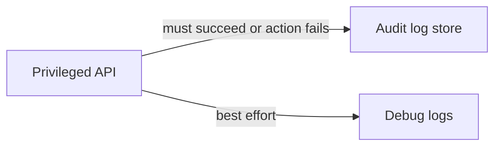

# Tamper-evident audit logs

An audit log answers who did what to which object, when, and from where. Tamper-evident means a later edit or a gap is detectable. It does not mean the log is immune to an attacker who also holds the signing key. Debug logs are a different stream: high volume, short retention, weaker integrity.

ASVS 5.0.0 chapter V16 covers security logging and error handling. See [OWASP ASVS](../security/owasp-asvs.md).

## What to record

| Field | Rule |
|---|---|
| Actor | Authenticated user or workload id, never a client-supplied name alone |
| Action | A stable verb (`role.grant`, `export.create`), not a free-text sentence |
| Object | Type and id. Avoid copying the whole payload if it is personal data |
| Time | From a synchronized clock, in UTC, including the time the action occurred and the time it was recorded if those differ |
| Source | Source service, source IP or workload id, request id |
| Result | Allowed or denied, and a reason code for denies of privileged actions |
| Before / after | For config and permission changes, the changed fields only |

## Defaults

- Append-only store: object storage with retention lock, a log that rejects updates, or a hash chain where each record commits to the previous digest. Pick one and monitor gaps in the sequence.
- The application role can insert and cannot update or delete. A break-glass role that can delete is itself audited to a separate destination.
- Ship audit events through a path that is not the debug logger. If the debug pipeline drops under load, audit events still land, or the privileged action fails. Decide which. Failing closed is right for permission changes and exports.
- Access to read the audit log is authorized and audited.
- Retention matches the longest contractual or regulatory window you actually have. Do not keep personal payloads inside the audit record for that whole window if a reference and a hash would do.
- Clock skew is monitored. An audit record with a time you cannot defend is weak evidence.
- Customers who must see their own audit trail get a tenant-scoped view. They do not get your platform-operator log unless the contract says so. Platform-operator access to their data is still recorded.

## Checklist

- [ ] Granting an admin, exporting data, changing SSO, and impersonating a user each write an audit event.
- [ ] An engineer with production database access cannot change history without a detectable gap or a second logged path.
- [ ] A test proves a deleted audit object is either impossible or alarmed.
- [ ] The record does not contain secrets or full PHI by default.
- [ ] Time source is NTP or the cloud equivalent, and you alert on large skew.

## Anti-patterns

- "We have logs" when the only logs are request access logs that rotate every seven days and omit the actor on admin routes.
- Letting the same admin UI delete audit rows.
- A hash chain whose last hash is stored in the same database the admin can update, with no external anchor.
- Logging the action and not the denial. Attackers generate denials.
