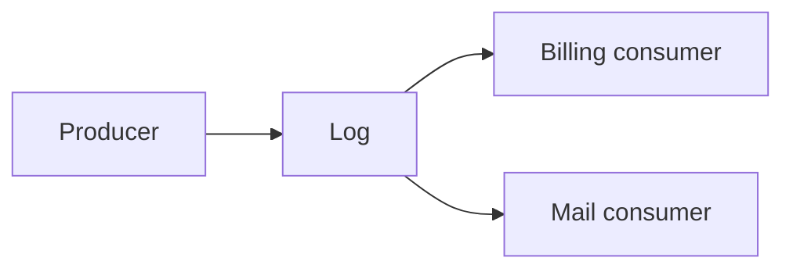

# Event-driven architecture

An event is a fact about something that already happened (`InvoiceIssued`), not a command to a named service (`SendEmail`). The producer owns the fact. Each consumer owns what it does with the fact. Delivery on a log or a queue is almost always at-least-once, so consumers are idempotent.

The Primer's message-queue section is the operational sketch. The pattern card is [message queues](../../patterns/message-queues.md). Chris Richardson's pattern catalog at microservices.io is all rights reserved; link it, do not copy it: <https://microservices.io/patterns/index.html>.

## Decide

| Choose | Use when | Avoid when |
|---|---|---|
| Queue (competing consumers) | A unit of work should be done by one worker, then removed | Several independent teams must each see every event |
| Log (pub/sub, replay) | Consumers have their own offsets, and you may replay | You need a per-message ack and a dead-letter per consumer inside one shared offset only |
| Direct RPC | The caller needs the answer to finish the user request | You are adding a queue to a call that is already fast and required for the response |
| Event carried state vs event notification | Notification (id only) keeps payloads small but forces a query back. Carried state lets the consumer work offline but couples it to the snapshot | You publish your private table row as the public event. That is an accidental API |

## Defaults

- Name events in the past tense. Include a stable event id, the aggregate id, the tenant, the time the fact occurred, and a schema version.
- The producer does not know the consumer list. If it did, you still have a distributed monolith.
- Ordering, if required, is per key (tenant or aggregate), not global.
- Consumers dedupe on event id. Side effects use their own idempotency store.
- Failures go to a retry with backoff, then a dead-letter queue that a human or a repair job can see. Poison messages do not block the partition forever without a decision. Sometimes they should block, for a payment. Say which.
- Replay is a feature of a log. Consumers must tolerate it. A mailer that sends on every replay will spam unless it records what it sent.
- The user request does not commit only to an in-memory publish. Use an [outbox](transactional-outbox.md) or accept the dual-write hole in writing.

## Anti-patterns

- A "bus" that is a mesh of synchronous calls hidden behind an event name.
- Sharing a database table as the integration contract and also publishing events about it, with neither owned.
- Global order as a requirement. It will cap your throughput at one partition.
- Events with no version and no owner, that cannot be changed because nobody knows the consumers.
