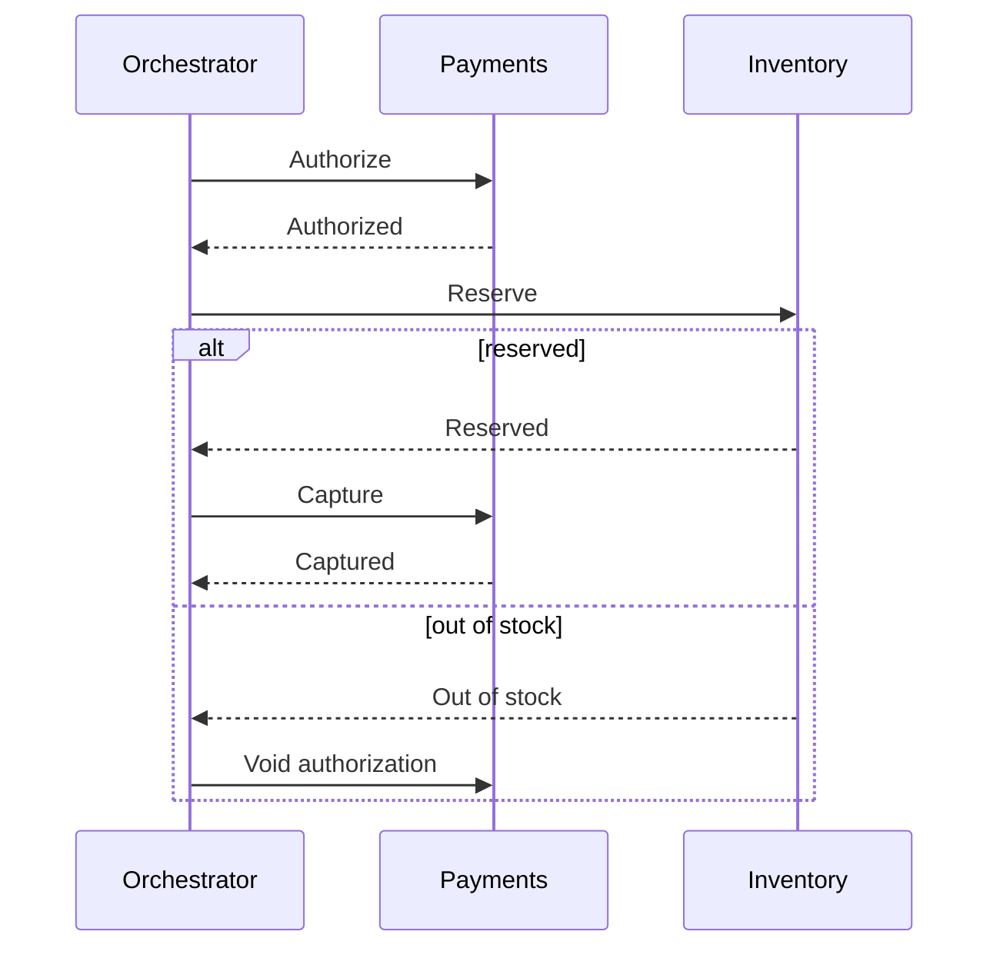

# Sagas

A saga is a sequence of local transactions. Each step commits in its own service. If a later step fails, earlier steps run compensations (void an authorization, release reserved stock), not a roll-back of someone else's commit. A refund is the compensation only after a capture has already succeeded, which is why the capture runs last. Two-phase commit across services is the thing the saga is replacing. Do not add 2PC lightly. It couples availability of every participant to one lock.

Pattern card: [saga](../../patterns/saga.md).

## Decide

| Style | Use when | Avoid when |
|---|---|---|
| Choreography | Few steps, each service already emits events, and no team wants to own a coordinator | The flow has many branches. Nobody can draw the current state without reading five repositories |
| Orchestration | The flow is a product (checkout, onboarding) with timeouts, branches, and a status the user asks about | The orchestrator would become a grab bag of other teams' private rules. Keep it to sequencing and timeouts |
| One database transaction | The data is still in one database. Use it | You split the database only so you could use a saga |

## Defaults

- Every step is idempotent. A retry of "reserve inventory" does not reserve twice. Compensations are idempotent too. "Refund" applied twice is a second refund unless you key it.
- The saga has an explicit state: running, completed, compensating, failed. For orchestration, that state lives in the orchestrator's store. For choreography, each service's local state must be enough, or you will not be able to answer "where is this order."
- Timeouts are steps. A payment that never calls back must move the saga on, to a compensation or to a reconciliation queue.
- Do not compensate what you cannot undo (an email already sent). Put irreversible steps as late as you can, or make them "send once" with a record.
- Observability: one id ties the whole saga. The user-visible status comes from saga state, not from guessing which event arrived.
- The outbox still applies inside each service. The saga does not excuse a dual write.

## Anti-patterns

- A compensation that can fail permanently with no human queue. You now have a hold you never voided, or a captured payment and no stock, and no alert.
- Distributed locks held for the whole saga. You rebuilt a long transaction.
- Choreography cycles (A waits for B waits for A).
- Using a saga between tables in the same database that could have been one commit.
