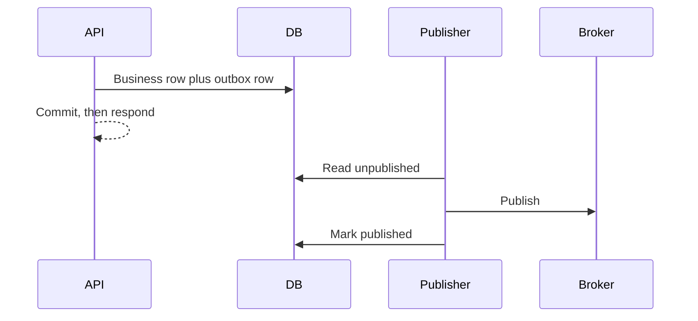

# Transactional outbox

Two writes that are not in one transaction will diverge. The request commits the order row and then the process dies before publish. Or the event is published and the transaction rolls back. The outbox puts the message in the same commit as the business write. A separate publisher reads the outbox and publishes, at least once.

Pattern card: [transactional outbox](../../patterns/transactional-outbox.md).

## Defaults

- In the same transaction: update the business tables, insert one outbox row (event id, type, aggregate id, payload, created time).
- The publisher selects unpublished rows, publishes, then marks them published. If the process crashes after publish and before the mark, it publishes again. Consumers dedupe on event id.
- Only one publisher works a given row. Use a lease, `FOR UPDATE SKIP LOCKED`, or a log-based reader.
- Payload is the public event, not an ORM object. Version it. See [schema evolution](schema-evolution.md).
- The outbox is pruned after publish plus a retention window long enough to debug. It is not a second event log unless you decide it is.
- If you already stream the database log, the publisher can be [CDC](cdc.md) on the outbox table instead of a polling loop. The transaction property is the same.
- The user request returns after the database commit, not after the broker ack, unless the requirement says the event is visible to others before you respond. Those are different latencies. Write which one you promise.

## Checklist

- [ ] There is no path that updates the business row and publishes without the outbox.
- [ ] Event ids are unique and stable across republish.
- [ ] A stuck publisher alarms on outbox age, which is the user-visible lag if downstream freshness matters.
- [ ] A poison payload can be quarantined without freezing every other aggregate.

## Anti-patterns

- "We will publish first and then commit" so consumers never miss an event. They will observe events for transactions that rolled back.
- Marking published before the broker accepts.
- An outbox in a different database from the business write. That is two transactions again.
- Using the outbox as a work queue for ten unrelated jobs with different SLOs. Separate tables or separate types with their own lag alerts.
