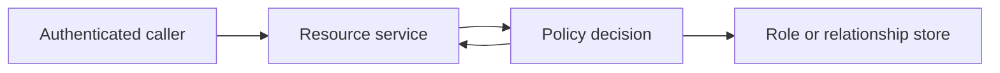

# Authorization models

Authentication says who is calling. Authorization says what that caller may do. The check runs on the server that owns the data. The tenant and the subject come from the credential, not from an unverified body field.

## Decide

| Model | Use when | Avoid when |
|---|---|---|
| RBAC (role-based) | Permissions cluster into a small set of jobs (admin, member, billing, auditor) and stay stable | Every customer invents exceptions, or roles start encoding combinations ("editor-but-not-of-payroll") |
| ABAC (attribute-based) | The decision depends on attributes of the subject, resource, and context (classification, region, time, device) | You cannot name the attributes or keep them current. A policy no one can explain will be bypassed |
| ReBAC (relationship-based) | Access follows a graph: user member of group, group editor of folder, folder parent of document | The only question is "does this user have role R in this tenant." A graph engine is extra machinery for that |
| ACLs on the object | Objects are few and each has its own explicit list | The list is large, inherited, or must be explained across a hierarchy. That is ReBAC with a worse query |

Most products start with RBAC inside a tenant, add a few ABAC rules (region, data classification), and introduce ReBAC only where sharing graphs are the product (documents, folders, projects).

## Defaults

- Default deny. A missing policy is a denial, not an allow.
- One policy decision point. Services ask it or embed the same policy. They do not invent a second role table.
- Roles map to permissions. Check the permission (`invoice.export`), not the role name (`admin`), so role bundles can change without rewriting call sites.
- Separate control-plane permissions (manage users, change SSO, read audit) from data-plane permissions (edit a record).
- Tenant id is a scope on every check. A role in tenant A never applies in tenant B.
- Pass the authenticated subject and the resource id into the decision. Do not trust an `isAdmin` flag from the client.
- Cache decisions briefly if the check is remote, and invalidate on membership change for privileged actions. A five-minute cache of "removed admin" is an incident.
- Emit an authorization denial log that includes subject, action, resource, and decision id. Do not log the whole object.

## Checklist

- [ ] Every mutating route and every "get by id" route checks authorization, including internal jobs.
- [ ] Listing endpoints filter in the query, and the filter uses the same decision as the point read.
- [ ] Cross-tenant identifiers in the URL return 404 or 403 consistently, and do not reveal whether the other tenant's id exists, if that disclosure matters.
- [ ] Privilege changes (grant admin, change SSO) are audited.
- [ ] Tests cover an allow, a deny, and a wrong-tenant subject for each sensitive action.

## Anti-patterns

- Role explosion: a new role for every customer exception instead of a permission or an attribute.
- "The gateway already checked auth" with no resource-level check in the service that holds the row.
- Hiding buttons in the UI and leaving the API open.
- Storing a permission bit in a JWT that cannot be revoked for hours, for an action you must be able to revoke now.
