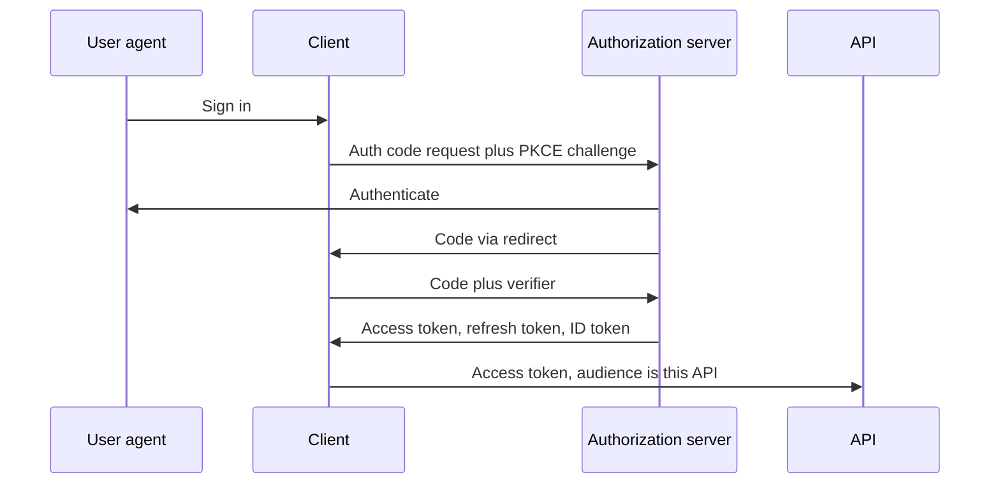

# OIDC and OAuth 2.0

OAuth 2.0 delegates access. OpenID Connect (OIDC) adds an identity layer: an ID token that says who signed in. An access token is not proof of identity for your client, and an ID token is not a credential for your API.

## Decide

| Choose | Use when | Avoid when |
|---|---|---|
| Authorization code + PKCE | A person signs in from a browser, mobile app, or SPA, and you can complete a redirect | The caller is a backend job with no user |
| Client credentials | A service calls an API as itself, inside a trust domain that already issues OAuth tokens | A user is present and you need their identity; or the platform already has workload identity |
| Device authorization | The client cannot show a redirect (TV, CLI) | A normal browser is available |
| Refresh token rotation | A long-lived session must survive short access-token lifetimes | You cannot store the refresh token in a place the attacker does not already own |
| Implicit, or resource-owner password | Never for new work | Always. Implicit drops the code and puts tokens in the fragment. Password grant collects the user's password |

## Defaults

- Public and confidential interactive clients both use authorization code with PKCE (`S256`). A client secret does not replace PKCE on a channel that can leak the code.
- Access tokens live 5–15 minutes. Audience is the resource server, not "any API we run."
- Refresh tokens are rotating, one-time, and sender-constrained (DPoP or mutual TLS) when the client can do it. Reuse of a rotated refresh token revokes the family.
- ID tokens are for the client. Validate issuer, audience (the client id), expiry, nonce, and signature. Do not accept an ID token at the API.
- Prefer opaque reference tokens at the edge if you must revoke instantly and can afford an introspection hop. Use JWTs when verifiers are many and revocation can wait for expiry, and keep the token small.
- Browser apps: keep tokens out of `localStorage`. A backend-for-frontend holds the refresh token in an `HttpOnly` `Secure` `SameSite` cookie and calls APIs on the user's behalf.
- Exact-match redirect URIs. Check `state` on the redirect. OIDC `nonce` binds the ID token to the login request.
- Scopes are coarse delegation ("this app may read invoices"). Authorization inside the product is a separate decision. See [authorization models](authorization-models.md).

## Checklist

- [ ] Every token has an issuer, audience, expiry, and a key the verifier already trusts.
- [ ] The API rejects tokens minted for a different API.
- [ ] Logout and account disable have a defined effect: short access-token life, refresh revocation, or a session denylist.
- [ ] The authorization server being down has a defined behavior (fail closed for new logins; existing short-lived tokens may continue until expiry).
- [ ] Authorization codes, refresh tokens, and client secrets are not logged.

## Anti-patterns

- Putting the user id or tenant id only in a client-supplied header while the token says something else.
- Accepting `alg=none` or a key fetched from an unverified `jku` URL.
- One long-lived shared API key called "OAuth" because it sits in an `Authorization` header.
- Using the ID token as the access token "because it is a JWT."
- Skipping PKCE because the client also has a secret.

## Where this sits

ASVS 5.0.0 chapters that cover this area are V6 Authentication, V9 Self-contained Tokens, and V10 OAuth and OIDC. Requirement text stays in the OWASP standard (CC BY-SA 4.0); the chapter map is in [OWASP ASVS](../security/owasp-asvs.md). The license note is in [pack/corpora/INDEX.md](../../pack/corpora/INDEX.md).
