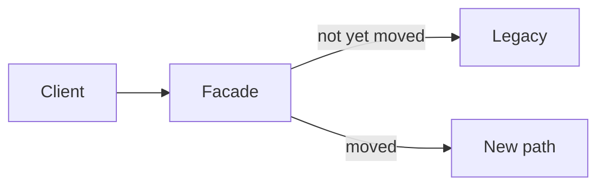

# Strangler fig

A strangler fig grows around a tree and eventually replaces it. In software, a facade routes each capability either to the legacy system or to the new one. You move one capability when the new path matches the old, then you delete the old path. The name comes from Martin Fowler's description of this migration. This page is an operational checklist, not a copy of that article.

Pattern card: [strangler fig](../../patterns/strangler-fig.md).

## Defaults

- Characterize the legacy behavior you intend to keep: inputs, outputs, and the quirks callers depend on. Write them down or capture them as characterization tests.
- Introduce the seam at a place you can route: an HTTP facade, a queue consumer, or a module boundary inside a [modular monolith](modular-monolith.md).
- Route by capability, not by "percentage of random requests," unless both paths are equivalent. A tenant or a use case at a time is easier to undo.
- Compare outputs while both paths run, if the operation is a read or a reversible write. Differences are bugs, not noise, until you explain them.
- The new path owns its data for the capabilities it has taken. Dual-writing forever is not a strangler. It is two sources of truth.
- Each extraction has a done state: traffic at zero on the old path, code deleted, alert removed.
- Rollback is routing back to legacy until the new path's data would make that unsafe. After a one-way data move, rollback is a restore plan, not a config flip.
- Do not strangler and redesign the domain in the same step if you can help it. Replace first, then change behavior, or you will not know which one broke the customer.

## Anti-patterns

- A big-bang rewrite behind a feature flag you intend to flip on a Friday.
- A facade that contains business logic the new system also contains.
- Leaving the legacy path "just in case" with no traffic and a full on-call burden.
- Migrating the database tables first and the callers never, so both systems write the same rows.
