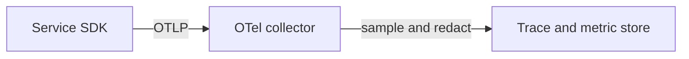

# OpenTelemetry

OpenTelemetry (OTel) is the vendor-neutral instrumentation framework and the OTLP export protocol. Use it so application code does not import a vendor SDK. The collector is where you sample, redact, and route.

This page is practice, not a copy of the project docs. Specs and semantic conventions live at <https://opentelemetry.io/>.

## Defaults

- Use the language SDK or auto-instrumentation for HTTP, gRPC, and the database client you actually run. Name spans after the operation (`GET /invoices/{id}` with the route template, not the raw path).
- Propagate W3C `traceparent` across your own HTTP and messaging hops. Decide explicitly whether you accept inbound trace context from the public internet. Accepting it lets a caller force sampling flags. Many edges start a new trace and log the inbound id as a link instead.
- Set resource attributes: `service.name`, `service.version` (the artifact digest or semver), and the deployment environment. Do not put the tenant id on the resource. It is request-scoped.
- Export OTLP to a local or cluster collector. Applications do not hold vendor credentials.
- The collector redacts, limits attribute length, and sets sampling. Tail sampling can keep errors and slow traces if you can afford the buffer.
- Metrics and logs can share the same collector. You do not have to adopt all three signals on day one. Traces plus RED metrics are the usual first step.
- Semantic conventions beat invented attribute names, so a backend can group `http.request.method` across services. When you diverge, write the name down once.
- Baggage is not for secrets or authorization. It is copied across services. Treat it as untrusted input.

## Checklist

- [ ] A request from the gateway shows child spans for the downstream API and the datastore.
- [ ] Sampling still keeps error traces.
- [ ] Attribute values are bounded. A 2 MB SQL statement is not a span attribute.
- [ ] Upgrading the collector does not require redeploying every service.
- [ ] `service.name` matches the on-call service in the catalog.

## Anti-patterns

- One exporter per vendor inside the binary, plus a second logging agent, with different ids.
- Recording request and response bodies on every span.
- A collector per developer experiment in production with no memory limit, becoming the outage.
- Using a trace as the audit log. Traces are sampled and short-lived.
