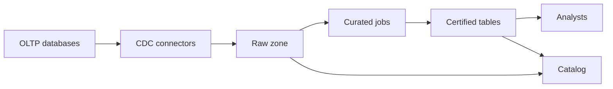

# Data platform

Product databases stay the systems of record. A data platform lands changes into object storage, curates tables analysts are allowed to use, and keeps a catalog of owners and classification. Raw data is not a certified dataset.

Out of scope: real-time product features served from the warehouse, a data mesh with dozens of domains on day one, and training models on customer content.

## Functional requirements

- An owner of an operational database can register it for CDC. Registration is reviewed because it copies data out of the product's access controls.
- Analysts can query certified tables (the curated zone) with SQL. They cannot query another team's raw prefix unless that team grants it.
- A certified table has an owner, a grain, a freshness target, and a classification.
- A loader can be re-run for a day without doubling counts.
- A person-deletion request removes or crypto-shreds that person's fields from raw and curated zones within 30 days, and snapshot expiry is not longer than that unless a legal hold is set.
- A producer can see which certified tables read its stream before it drops a column.

## Non-functional requirements

| Target | Value | Condition |
|---|---|---|
| Freshness of certified tables | Under 1 hour | While the source and the connector are healthy |
| OLTP impact | CDC adds under 5% primary CPU | Measured on the replica or the log, not with analytical SQL on the primary |
| Durability of landed files | The object store's durability | A bad transform can be rerun from raw |
| Rebuild | A certified table can be rebuilt from raw in under 1 day | For the current volumes |
| Access | Group-based, reviewed quarterly | No shared analyst password |
| Residency | EU sources land in an EU bucket | A separate pipeline, not a filter after a global landing |

## Estimates

Given: three operational databases, together 40 GB/day of logical change (updates are a large share). Assumed 2× storage amplification in the raw table format (copies, files, metadata). Assumed curated zone is 20% of raw after projection. Assumed 90 days of raw snapshots kept for rebuild, unless a shorter deletion rule applies to personal-data tables.

- Raw growth ≈ 40 GB/day × 2 = 80 GB/day. 90 days ≈ 80 × 90 = 7,200 GB = 7.2 TB before compaction. Curated is 20% of that raw rate: 0.2 × 80 GB/day × 365 = 5,840 GB = 5.84 TB in a year. These are small for object storage and large enough to punish a full scan every five minutes.
- Connector lag budget is 10 minutes so the hourly curated SLO has room for the transform.
- Analyst concurrency assumed at 30 simultaneous queries. A warehouse engine sized for that is a fixed cost. The variable cost is scanned bytes. A dashboard that scans the 7.2 TB raw window every refresh will dominate the bill. Certified tables are partitioned by day so a daily dashboard scans one partition.
- 10× change volume (400 GB/day) is still an object-storage problem, not an OLTP problem, only if CDC stays on the log. If someone "simplifies" by querying the primary, the product SLO dies first.
- Decimal GB (10^9).

## Component sketch

| Box | Owns | Does not own |
|---|---|---|
| CDC connector | Reading the log and landing files, idempotent file names | Business definitions |
| Raw zone | Faithful change history | Analyst-facing guarantees |
| Curated jobs | The certified grain, tests, and rebuild | The product transaction |
| Catalog | Owner, class, freshness, lineage | The bytes |
| Analyst warehouse role | Query rights on certified tables | Raw, unless explicitly granted |

## Component choices

| Concern | Choice | Rejected | Why it lost |
|---|---|---|---|
| Capture | Log-based CDC from a replica where the engine allows it | Triggers on the primary | Write amplification on the hot path |
| Table format | An open table format on object storage (Iceberg, Delta, or Hudi) | A pile of raw JSON as the analyst interface | Analysts need schema, incremental merge, and a deletion path |
| Transform | Scheduled SQL or Spark jobs with a partition replace | A hand-maintained spreadsheet of numbers | Not rebuildable |
| Serving | Warehouse engine or the lakehouse SQL engine the company already runs | The OLTP replica for ad hoc joins | Protects the product. The replica still has a replication-lag budget |
| Personal data | Separate raw prefix, shorter snapshot life, deletion job keyed by person id | One bucket with a wiki policy | The policy will not be applied |
| Contracts | Schema registry check, backward compatible | Informal JSON | A renamed column breaks certified tables the morning after |

## Tradeoffs

- Freshness is one hour, not seconds. Cost: the platform cannot back a product feature that needs the latest order. That feature reads the OLTP API.
- Raw keeps enough history to rebuild, which fights minimization. Cost: personal-data tables use a 30-day snapshot cap and a deletion job, not the 90-day default.
- EU and US are separate landing zones. Cost: two pipelines to operate. A single global bucket was rejected because a mis-set prefix would mix residents.
- Analysts do not get raw by default. Cost: more curation work before a question can be answered. The alternative is a broad grant that copies production access control into everyone's laptop.

## Failure modes and blast radius

| Failure | Blast radius |
|---|---|
| Connector stops | Certified tables go stale. OLTP is unaffected if CDC reads a replica or the log, not the primary CPU. Alert on lag past 15 minutes |
| Bad transform | One certified table. Rebuild the partition from raw. Other tables stay |
| Raw bucket deleted | Rebuilds die. Certified tables still serve until someone needs a rebuild. Object lock or a second copy for raw of record-level systems |
| Wrong grant on raw | That prefix's data is readable to the grantee. Grants are audited. Personal-data prefixes have a tighter group |
| Schema break | The compatibility check should stop the producer. If it does not, the curated job fails and the previous partition remains, marked stale |
| Primary used as a source by mistake | Product latency. The platform's SLO is the wrong place to notice. The product SLO burns |

## Design review

Reviewed against [checklist.md](../../pack/skills/design-reviewer/checklist.md).

### 1. Deletion versus snapshot life is only solved for "personal-data tables"
- Severity: High
- Area: Data retention and deletion
- Evidence: The design caps snapshots at 30 days for personal-data tables and 90 days otherwise, but the classifier who marks a table is not named, and CDC of a wide row will copy personal columns into a table nobody marked.
- Why it matters: Unmarked raw data keeps a person for 90 days after the product deleted them, past the 30-day promise, and possibly in a certified table built yesterday.
- Change: Default new CDC registrations to the personal-data prefix until an owner classifies them. Block certification if the source is unclassified.

### 2. Replica CDC can still hurt the primary
- Severity: Medium
- Area: Failure modes and blast radius
- Evidence: "Under 5% primary CPU" assumes the log is read from a replica. Some engines apply CDC from the primary's log slot, and a stalled slot retains WAL until the primary disk fills.
- Why it matters: A platform connector incident becomes a product outage.
- Change: Per source, name where the slot lives. Alert on slot size. Fall back to pausing CDC, not to filling the disk.

### 3. Lineage is "a producer can see tables" without a mechanism
- Severity: Medium
- Area: Migration and rollback
- Evidence: Producers must see consumers before dropping a column. The catalog "owns lineage" and does not say it is produced from job code or maintained by hand.
- Why it matters: A hand-maintained catalog will be wrong the first time a job is copied.
- Change: Derive dataset-level lineage from the job definitions in CI, and fail a breaking schema change when a consumer is in that graph.

### 4. EU and US separation is a pipeline promise without a test
- Severity: Medium
- Area: Compliance and audit logging
- Evidence: Separate landing zones are the residency control. Nothing tests that an EU source cannot be configured with a US bucket.
- Why it matters: One registration form mistake moves residents' data.
- Change: The registration record carries the source region, and the apply step rejects a bucket outside that region.

### 5. Scan cost is described and not alarmed
- Severity: Low
- Area: Cost
- Evidence: The estimate says a 7.2 TB raw-window scan will dominate and then relies on partition discipline.
- Why it matters: One dashboard can spend the month's budget over a weekend.
- Change: A per-team scanned-byte budget with an alert, using the warehouse engine's query history.

## Accepted risks

- Certified freshness of one hour. Product paths do not read this platform.
- Raw files for non-personal operational facts keep 90 days of snapshots so a bad curated job can be rebuilt.
- Three source databases on day one. A self-serve registration portal waits until classification and the slot alert exist. Until then, registration is a reviewed change.
