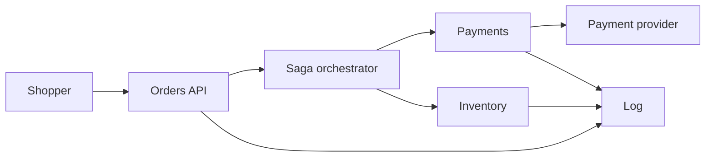

# Event-driven orders and payments

A retailer takes an order, charges a payment provider, reserves inventory in a warehouse system, and emits shipment instructions. The three capabilities are separate services with separate databases. Card numbers stay at the payment provider. This system stores a provider token and an idempotency key.

Out of scope: the catalog browse path, tax calculation detail, and a multi-region active-active write topology.

## Functional requirements

- A shopper can submit an order once. A retry with the same idempotency key returns the same order id and does not create a second order.
- On success the order reaches `paid` and inventory is reserved. The shopper can read that status.
- If inventory cannot be reserved after a successful charge, the charge is refunded and the order reaches `cancelled`.
- A warehouse worker can mark the order `shipped`. That transition happens once.
- Support can read the saga timeline for one order id.
- The payment provider can retry a webhook. The same provider event id does not capture or refund twice.

## Non-functional requirements

| Target | Value | Condition |
|---|---|---|
| Submit acknowledgement | p99 under 250 ms | Order row committed. Payment may still be pending |
| Checkout completion | p99 under 5 s | Charge and reserve, provider healthy |
| Payment correctness | No double capture for one idempotency key | Including timeouts and provider retries |
| Inventory | No oversell of a reserved unit | Reservation is a conditional write |
| Availability | 99.9% on submit | Completion depends on the provider and is measured separately |
| RPO | 0 for the order database inside the region | Synchronous replica |
| Reconciliation | Every `charging` order older than 2 minutes is resolved | By the provider's read API, not by guessing |

## Estimates

Given: 2 million orders/day average. Assumed peak 8× for a sale, so peak order submits = 2×10^6 / 86,400 × 8 ≈ 185/s. Assumed three saga steps that emit an event each, so about 550 events/s peak. Assumed 1 KB per event.

- Order writes at peak ≈ 185/s. A single Postgres primary handles this if the transaction is the order row plus one outbox row.
- Payment concurrency: if the provider call averages 400 ms, in flight ≈ 185 × 0.4 ≈ 74. A bulkhead of 150 leaves headroom. At 10× submit (1,850/s) in flight ≈ 740, which will hit both the bulkhead and the provider's quota. Shed submits before that. Do not buffer unbounded checkouts.
- Event log, 14 days: 2×10^6 orders × 3 events × 1 KB × 14 ≈ 84 GB plus replication. Retention is for replay, not for the system of record. The order tables are the source of truth.
- Inventory is the hot key risk. A popular SKU is one row. 185 conditional updates/s on one row will serialize. The estimate says so: popular SKUs need a reservation technique that does not update one row per unit (pre-allocated buckets, or a queue per SKU with a single writer).

## Component sketch

| Box | Owns | Does not own |
|---|---|---|
| Orders API | Idempotent submit, order status read | The charge |
| Orchestrator | Saga state, timeouts, compensations | Another service's tables |
| Payments | Provider idempotency key, capture and refund | The card number |
| Inventory | Available units and reservations | Money |
| Log | At-least-once transport | The business decision |

Each service writes its state and an outbox row in one local transaction. The orchestrator consumes those events.

## Component choices

| Concern | Choice | Rejected | Why it lost |
|---|---|---|---|
| Coordination | Orchestrated saga | Choreography | Support must answer "where is this order." Three branches and a timeout are easier to see in one state machine |
| Charging | Orchestrator calls payments. Payments calls the provider with a stable idempotency key | Orders API calls the provider directly | The API would then own a side effect it cannot roll back when inventory fails |
| Messages | Outbox per service into one log | Dual write to the broker | Crashes between commit and publish |
| Inventory hot SKU | Single writer per SKU partition, conditional decrement | A distributed lock across services | The lock would become a global bottleneck and a deadlock source |
| Reads of status | The order row, updated by the orchestrator | A projection only | The shopper's read-your-writes is the order row. A search projection can lag |
| Card data | Provider hosted fields. We store a token | PAN in our database | Keeps the cardholder environment out of this system. See [HIPAA and PCI](../compliance/hipaa-pci.md) for why scope is the design |

## Tradeoffs

- Submit returns before the charge finishes. The UI polls status. Cost: a client that treats HTTP 201 as "paid" is wrong. The response body says `pending`.
- Refund is a compensation, not a database rollback. Cost: a refund can fail. The saga stays in `compensating` and pages payments on-call after two minutes.
- One region. The provider is already multi-region. Our order primary is not. Cost: a region loss stops checkout. RPO inside the region is the synchronous replica.
- The log is not the ledger. Replaying it must not capture again. Cost: every consumer dedupes, and payments dedupes on the provider key even if the log is replayed.

## Failure modes and blast radius

| Failure | Blast radius | User-visible behavior |
|---|---|---|
| Provider timeout after capture | That order | Saga reads the provider by idempotency key before refunding or retrying. It must not capture again |
| Inventory down | New checkouts that need a reservation | Submit can still record a pending order or refuse. This design refuses new submits if the inventory circuit is open, and leaves in-flight sagas to time out and refund |
| Orchestrator down | Progress of in-flight sagas | Submits that only write the order row still ack. A second orchestrator instance resumes from saga state. Do not run two active workers on the same order without a lease |
| Poison event | One partition if the key is the order id | Other orders continue. The poison order goes to a dead-letter after five attempts and alerts |
| Bad deploy of payments | Captures | Canary on payments. Rollback stops new captures. In-flight provider calls still need reconciliation |

## Design review

Reviewed against [checklist.md](../../pack/skills/design-reviewer/checklist.md).

### 1. Refund idempotency depends on a provider read that is not specified
- Severity: High
- Area: Failure modes and blast radius
- Evidence: The design says a timeout reads the provider by idempotency key, and also says refunds page on-call after two minutes. It never names the refund idempotency key.
- Why it matters: Two orchestrator attempts can refund twice if the first refund timed out after the provider accepted it.
- Change: Send a refund key derived from the order id (`refund:{orderId}`) and store the provider refund id on the saga. Retries return the stored refund.

### 2. Popular SKU writes are admitted to be unsafe and left unchosen
- Severity: High
- Area: Behavior at 10× load
- Evidence: The estimate says one row at 185 updates/s will serialize, then names two techniques and picks neither.
- Why it matters: The sale peak is the requirement. The default single-row decrement will time out and compensate charges, which looks like a payments incident.
- Change: Pick pre-allocated quantity buckets per SKU for the sale path, with a single writer per bucket, before the next launch.

### 3. Two orchestrators can run one saga
- Severity: Medium
- Area: Consistency and replication
- Evidence: "Do not run two active workers on the same order without a lease" is a warning, not a mechanism.
- Why it matters: A deploy that doubles orchestrator replicas will double-drive compensations. The refund bug above gets worse.
- Change: Lease the saga row with `UPDATE ... WHERE lock_until < now()` in the same transaction that advances state.

### 4. Submit availability ignores a full bulkhead
- Severity: Medium
- Area: Observability and on-call
- Evidence: 99.9% is on submit, and submit refuses when the inventory circuit is open, but the SLI exclusions are not written.
- Why it matters: A dependency failure either burns the submit SLO or is quietly excluded. On-call will not know which.
- Change: Define the submit SLI as "order row committed or a deliberate 503," and alert on 503 rate separately so shed load is visible.

### 5. No cost line for provider retries
- Severity: Low
- Area: Cost
- Evidence: Provider calls dominate latency and are not in the cost driver.
- Why it matters: A retry storm is a bill and a quota incident, not just latency.
- Change: Name the per-order provider fee assumption and cap capture attempts at two plus the read-by-key reconciliation.

## Accepted risks

- Checkout completion depends on a third party. The 5 s objective is not the same SLO as submit.
- Region loss stops new orders. In-flight provider captures are reconciled when the region returns, using stored idempotency keys.
- The warehouse receives a shipment instruction only after `paid` and reserved. A lost instruction is re-emitted from saga state, not from memory.
