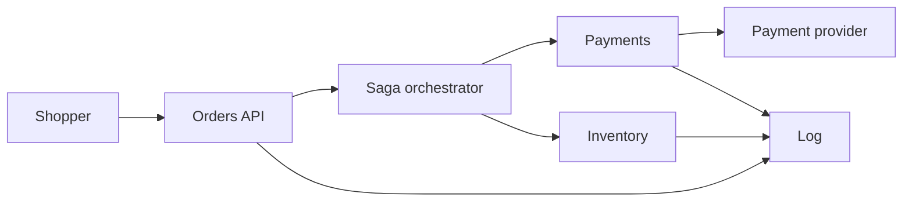
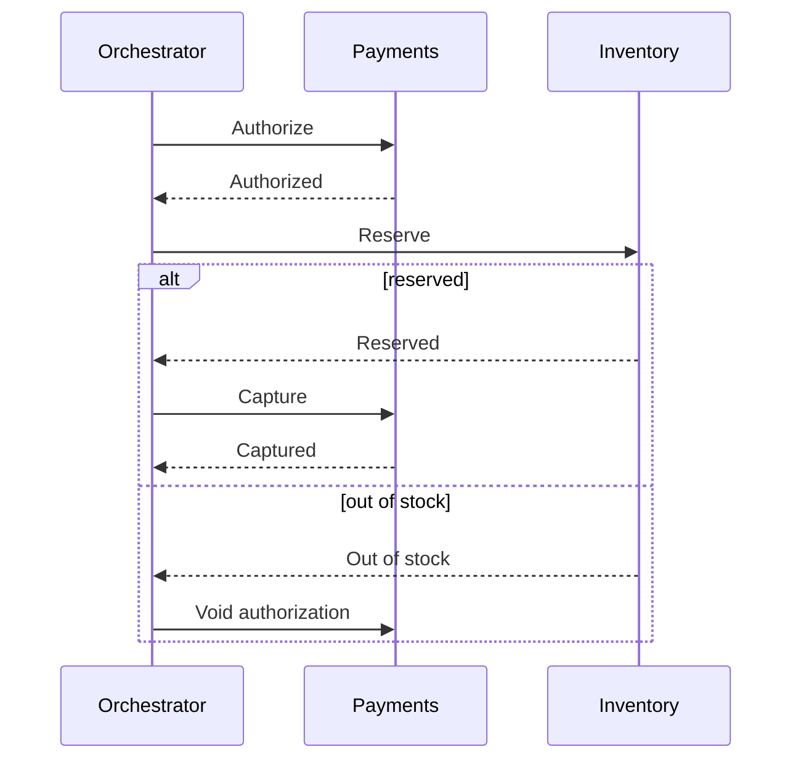

# Event-driven orders and payments

A retailer takes an order, authorizes payment, reserves inventory, captures the payment, and emits shipment instructions. The three capabilities are separate services with separate databases. Card numbers stay at the payment provider. This system stores a provider token and an idempotency key.

Out of scope: the catalog browse path, tax calculation detail, and a multi-region active-active write topology.

## Functional requirements

- A shopper can submit an order once. A retry with the same idempotency key returns the same order id and does not create a second order.
- On success the order is authorized, inventory is reserved, payment is captured, and the order reaches `paid`. The shopper can read that status.
- If inventory cannot be reserved after authorization, the authorization is voided, nothing is captured, and the order reaches `cancelled`.
- If capture fails after a reservation, the authorization is voided and the reservation is released.
- A warehouse worker can mark the order `shipped`. That transition happens once. It runs only after capture.
- Support can read the saga timeline for one order id.
- The payment provider can retry a webhook. The same provider event id does not authorize, capture, void, or refund twice.

## Non-functional requirements

| Target | Value | Condition |
|---|---|---|
| Submit acknowledgement | p99 under 250 ms | Order row committed. Payment may still be pending |
| Checkout completion | p99 under 5 s | Authorize, reserve, and capture, provider healthy |
| Payment correctness | No double authorize, capture, void, or refund for one order | Each call has its own idempotency key, including provider retries |
| Inventory | No oversell of a reserved unit | Reservation is a conditional write |
| Availability | 99.9% on submit | Completion depends on the provider and is measured separately |
| RPO | 0 for the order database inside the region | Synchronous replica |
| Reconciliation | Every order left in `authorizing`, `reserving`, or `capturing` for more than 2 minutes is resolved | By the provider's read API and the saga row, not by guessing |

## Estimates

Given: 2 million orders/day average. Assumed peak 8× for a sale, so peak order submits = 2×10^6 / 86,400 × 8 = 185.185/s, about 185/s. Three saga steps emit an event each (authorize, reserve, capture), so peak events = 185.185 × 3 = 555.6/s, about 556/s. Assumed 1 KB per event. Assumed each provider call (authorize and capture) averages 400 ms. Reserve is local.

- Order writes at peak ≈ 185/s. A single Postgres primary handles this if the transaction is the order row plus one outbox row.
- Payment concurrency: two sequential provider calls per order, so time in the provider is 0.8 s. In flight at peak ≈ 185 × 0.4 × 2 = 148. A bulkhead of 300 is about 2× that. At 10× the peak submit rate (1,850/s) in flight ≈ 1,850 × 0.8 = 1,480, which will hit both the bulkhead and the provider's quota. Shed submits before that. Do not buffer unbounded checkouts.
- Event log, 14 days: 2×10^6 orders × 3 events × 1 KB × 14 = 8.4×10^7 KB = 84 GB plus replication. Retention is for replay, not for the system of record. The order tables are the source of truth. Decimal KB (10^3 bytes).
- Inventory is the hot key risk. A popular SKU is one row. 185 conditional updates/s on one row will serialize. The estimate says so: popular SKUs need a reservation technique that does not update one row per unit (pre-allocated buckets, or a queue per SKU with a single writer).

## Component sketch

Saga order. Capture is the irreversible step and runs only after a successful reserve. A failed reserve voids the authorization. A failed capture voids and releases. A refund happens only after a capture has succeeded.

| Box | Owns | Does not own |
|---|---|---|
| Orders API | Idempotent submit, order status read | The payment calls |
| Orchestrator | Saga state, timeouts, compensations | Another service's tables |
| Payments | Provider idempotency keys for authorize, void, capture, and refund | The card number |
| Inventory | Available units and reservations | Money |
| Log | At-least-once transport | The business decision |

Each service writes its state and an outbox row in one local transaction. The orchestrator consumes those events.

## Component choices

| Concern | Choice | Rejected | Why it lost |
|---|---|---|---|
| Coordination | Orchestrated saga | Choreography | Support must answer "where is this order." Three branches and a timeout are easier to see in one state machine |
| Charging | Orchestrator calls payments. Payments authorizes first and captures only after inventory reserves, each with its own idempotency key | Orders API calls the provider directly, or capture before reserve | The API would own a side effect it cannot undo when inventory fails. Capture before reserve makes the common failure a refund |
| Messages | Outbox per service into one log | Dual write to the broker | Crashes between commit and publish |
| Inventory hot SKU | Single writer per SKU partition, conditional decrement | A distributed lock across services | The lock would become a global bottleneck and a deadlock source |
| Reads of status | The order row, updated by the orchestrator | A projection only | The shopper's read-your-writes is the order row. A search projection can lag |
| Card data | Provider hosted fields. We store a token | PAN in our database | Keeps the cardholder environment out of this system. See [HIPAA and PCI](../compliance/hipaa-pci.md) for why scope is the design |

## Tradeoffs

- Submit returns before capture finishes. The UI polls status. Cost: a client that treats HTTP 201 as "paid" is wrong. The response body says `pending`.
- A void releases a hold. A release returns reserved units. A refund returns money only after capture. None of these is a database rollback. Cost: a compensation can fail. The saga stays in `compensating` and pages payments on-call after two minutes.
- One region. The provider is already multi-region. Our order primary is not. Cost: a region loss stops checkout. RPO inside the region is the synchronous replica.
- The log is not the ledger. Replaying it must not capture again. Cost: every consumer dedupes, and payments dedupes on the provider key even if the log is replayed.

## Failure modes and blast radius

| Failure | Blast radius | User-visible behavior |
|---|---|---|
| Provider timeout during authorize | That order | Read the provider by the authorize key. Do not open a second hold. If the hold exists and inventory is not reserved, continue to reserve or void |
| Reserve fails | That order | Void the authorization. Do not capture. Release is a no-op if the reserve did not commit |
| Provider timeout during capture | That order | Read the provider by the capture key. If the capture is absent, retry once or void and release. If it succeeded, do not void and do not capture again. A later failure, such as a shipment that never goes out, is a refund, not a void |
| Inventory down | New checkouts that need a reservation | Submit refuses while the inventory circuit is open. In-flight sagas that are not yet captured void the authorization and release any reservation. They do not capture |
| Orchestrator down | Progress of in-flight sagas | Submits that only write the order row still ack. A second orchestrator instance resumes from saga state. Do not run two active workers on the same order without a lease |
| Poison event | One partition if the key is the order id | Other orders continue. The poison order goes to a dead-letter after five attempts and alerts |
| Bad deploy of payments | Captures | Canary on payments. Rollback stops new captures. In-flight provider calls still need reconciliation |

## Design review

Reviewed against [checklist.md](../../pack/skills/design-reviewer/checklist.md).

### 1. Void and refund idempotency depend on a provider read that is not fully specified
- Severity: High
- Area: Failure modes and blast radius
- Evidence: A timeout reads the provider by idempotency key, and compensations page on-call after two minutes. The failure table says to void or to refund. It never names the void key or the refund key.
- Why it matters: Two orchestrator attempts can void twice or, after a successful capture, refund twice if the first call timed out after the provider accepted it.
- Change: Send `void:{orderId}` when reversing an authorization that was not captured, and `refund:{orderId}` only after capture has succeeded. Store the provider ids on the saga. Retries return the stored result.

### 2. Popular SKU writes are admitted to be unsafe and left unchosen
- Severity: High
- Area: Behavior at 10× load
- Evidence: The estimate says one row at 185 updates/s will serialize, then names two techniques and picks neither.
- Why it matters: The sale peak is the requirement. The default single-row decrement will time out and compensate charges, which looks like a payments incident.
- Change: Pick pre-allocated quantity buckets per SKU for the sale path, with a single writer per bucket, before the next launch.

### 3. Two orchestrators can run one saga
- Severity: Medium
- Area: Consistency and replication
- Evidence: "Do not run two active workers on the same order without a lease" is a warning, not a mechanism.
- Why it matters: A deploy that doubles orchestrator replicas will double-drive compensations. The refund bug above gets worse.
- Change: Lease the saga row with `UPDATE ... WHERE lock_until < now()` in the same transaction that advances state.

### 4. Submit availability ignores a full bulkhead
- Severity: Medium
- Area: Observability and on-call
- Evidence: 99.9% is on submit, and submit refuses when the inventory circuit is open, but the SLI exclusions are not written.
- Why it matters: A dependency failure either burns the submit SLO or is quietly excluded. On-call will not know which.
- Change: Define the submit SLI as "order row committed or a deliberate 503," and alert on 503 rate separately so shed load is visible.

### 5. No cost line for provider retries
- Severity: Low
- Area: Cost
- Evidence: Provider calls dominate latency and are not in the cost driver.
- Why it matters: A retry storm is a bill and a quota incident, not just latency.
- Change: Name the per-order provider fee assumption. Cap authorize attempts and capture attempts at two each, plus the read-by-key reconciliation. Do not capture on the retry of a void.

## Accepted risks

- Checkout completion depends on a third party. The 5 s objective is not the same SLO as submit.
- Region loss stops new orders. In-flight provider captures are reconciled when the region returns, using stored idempotency keys.
- The warehouse receives a shipment instruction only after `paid` and reserved. A lost instruction is re-emitted from saga state, not from memory.
