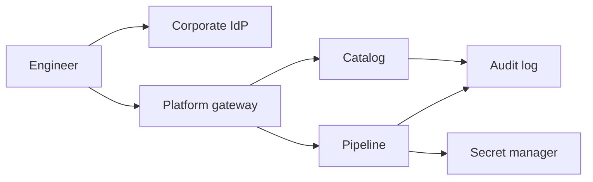

# Internal platform with SSO and audit

An internal platform lets product teams register a service, ship through a paved pipeline, read their own logs, and request production access. Every human action goes through corporate SSO. Privileged actions are audited.

Out of scope: the product teams' business databases, a customer-facing login, and a general data warehouse.

## Functional requirements

- An engineer signs in with the corporate IdP over OIDC. There is no platform-local password.
- A service has one owning team. The catalog stores the owner, the pager, the repo, and the on-call SLO link.
- A pipeline build produces a digest, an SBOM, and a signature. Production deploy accepts only a signed digest that the catalog knows.
- A human who opens a break-glass role gets it for one hour, from a ticket, and every command through the broker is audited.
- An auditor can export the audit log for a time range. The export is built from the audit store, not from debug logs.
- A team can see its own deploys and its own cost showback. It cannot see another team's secrets.

## Non-functional requirements

| Target | Value | Condition |
|---|---|---|
| Catalog read | p99 under 200 ms | Inside the corporate network |
| Deploy start | p99 under 2 min to the first instance | Image already built |
| Audit durability | An audited action is not acknowledged unless the audit append succeeded | Fail closed |
| Audit retention | 2 years | Then delete payloads that are not required, keep the hash chain anchor |
| Availability | 99.9% on catalog reads | Deploy can pause if the audit store is down. That is deliberate |
| Access | Corporate IdP group plus a platform permission | Leaving the company removes the IdP account the same day |
| RPO | 0 for audit records inside the region | Synchronous replica, plus a daily immutable copy in a second account |

## Estimates

Given: 800 engineers, 250 services, 40 production deploys per business day. Assumed: 30 catalog reads per engineer per day, 15 audit events per deploy (start, promote, finish, plus access checks), 50 break-glass sessions per month, 200 audit events per session.

- Catalog reads ≈ 800 × 30 / 86,400 ≈ 0.3/s average. Peak during the workday at 10× is still a few reads per second. This is not a scale problem. It is a control problem.
- Audit volume ≈ 40 × 15 events/day plus break-glass ≈ 600 + (50 × 200 / 30) ≈ 600 + 333 ≈ 1,000 events/day. At 1 KB, two years is under 1 GB. Integrity and access matter. Throughput does not.
- Build minutes are the cost driver, not the catalog. 250 services × 5 builds/day × 10 minutes = 12,500 build-minutes/day. A month of business days (22) is 12,500 × 22 = 275,000 build-minutes. If that daily rate holds all 30 calendar days, the month is 12,500 × 30 = 375,000 build-minutes. Showback uses build minutes and deployed replica-hours. The quantity to price is those minutes: 275,000 / 60 = 4,583 runner-hours on the 22-day month, or 375,000 / 60 = 6,250 runner-hours on the 30-day month. This design has no dollar rate card, so it does not convert hours to currency.
- Runner concurrency assumes the day's 12,500 minutes fall in an 8-hour window (480 minutes), which is a planning assumption, not a measurement. Average in flight = 12,500 / 480 ≈ 26 builds. A 2× daytime clump, also a planning factor, needs about 52 concurrent runners. If all 250 services start one 10-minute build together, 52 runners drain the queue in 250 / 52 × 10 ≈ 48 minutes. Size the pool for about 52 concurrent builds. The catalog QPS above is not the limit.
- 10× engineers (8,000) still does not stress Postgres. The bottleneck to design for is the IdP and the signing key, not QPS.

## Component sketch

| Box | Owns | Does not own |
|---|---|---|
| Gateway | Session cookie after OIDC, coarse authorization | The service's business data |
| Catalog | Ownership and deploy policy | The running containers |
| Pipeline | Build, sign, deploy, rollback | Who is allowed to click deploy. It asks the catalog |
| Audit log | Append-only record in a separate account | Debug logs |
| Secret manager | Runtime secrets, workload identity | Human-readable copies in CI variables |

## Component choices

| Concern | Choice | Rejected | Why it lost |
|---|---|---|---|
| Human auth | OIDC auth code with PKCE against the corporate IdP | A platform password database | Another password store is a worse IdP |
| Service auth | Workload identity to the secret manager and the cluster | Long-lived cloud keys in CI | Keys leak into logs and laptops |
| Audit store | Append-only log in a separate account, hash-chained, daily anchor written to object lock storage | A table in the catalog database | Catalog admins could update history |
| Deploy | Signed digest, progressive canary, previous digest kept | SSH and a pull on the host | Not attributable, not reversible |
| Break-glass | Per-person role, one hour, ticket id in the audit record, command broker | A shared root password in a vault | A shared password has no actor |
| Catalog store | Postgres | A git repo as the only source | Git is the change review. The runtime catalog must answer "who owns this now" even if git is down, and is filled from merged changes |

## Tradeoffs

- Deploy fails closed when the audit append fails. Cost: an audit-store outage blocks production deploys. Catalog reads stay up. The alternative, deploying without an audit record, fails the control the platform exists to provide.
- The catalog is eventually filled from merged pull requests (under a minute). Cost: a merge that has not been applied yet is not yet policy. The pipeline reads the catalog, not the git branch tip, so it cannot race ahead of an unmerged change.
- Break-glass is loud. Cost: engineers will want a quieter path. The quieter path is a standing workload identity for the service, not a human shell. Human shells stay loud.
- Single region for the control plane. Cost: a region loss stops deploys. Running workloads keep running. That split is acceptable for an internal platform and is not acceptable for the audit copy, which is why the daily anchor is in a second account (and a second region if residency of employee data allows it).

## Failure modes and blast radius

| Failure | Blast radius |
|---|---|
| IdP down | New sessions stop. Sessions already issued (8 hours) continue. Deploys by humans stop when the session ends. Workload deploys already in flight can finish |
| Audit store down | Privileged actions and deploys refuse. Catalog reads continue |
| Catalog down | Deploys and new service lookups fail. Running apps are unaffected |
| Bad platform deploy | All product teams' deploys. Canary the platform itself. Product workloads are not redeployed by a platform rollback |
| Stolen signing key | Attacker can sign artifacts the cluster will trust until the trust root is rotated. Rotation is a drilled procedure, not a hope |
| One team's pipeline identity compromised | That team's services, if authorization is per team. Not every secret in the company, if the identity was scoped |

## Design review

Reviewed against [checklist.md](../../pack/skills/design-reviewer/checklist.md).

### 1. Session lifetime is long relative to leaver handling
- Severity: High
- Area: Authentication and authorization
- Evidence: Existing sessions continue for 8 hours when the IdP is down, and the same number is the session lifetime. A leaver's token works until then.
- Why it matters: The requirement says leaving the company removes access the same day, not within eight hours. For a production control plane that is a long window.
- Change: Cut session lifetime to 1 hour with refresh against the IdP, and add a denylist fed by the IdP's deprovisioning hook so a leaver's refresh fails immediately.
- ASVS: V7 Session Management, V6 Authentication

### 2. Break-glass command broker is asserted, not bounded
- Severity: High
- Area: Security, mapped to OWASP ASVS 5.0.0
- Evidence: The design says every command goes through a broker and is audited. It does not say the cluster API is unreachable except through that broker.
- Why it matters: A direct credential to the cluster bypasses the audit. The control is then optional.
- Change: Remove standing cluster credentials from humans. The only human path is the broker's short-lived certificate.
- ASVS: V8 Authorization, V13 Configuration

### 3. Second-account audit copy is daily
- Severity: Medium
- Area: Single points of failure
- Evidence: RPO for audit is 0 inside the region via a synchronous replica, and the immutable copy is daily.
- Why it matters: A regional failure that also corrupts the replica (bad deploy of the audit service, destroyed account) loses up to a day of audit. That may be unacceptable for the control the platform claims.
- Change: Stream the hash anchor continuously to the second account, or state a 24-hour RPO for the cross-account copy as an accepted risk with a named owner.

### 4. Showback has no owner for untagged build minutes
- Severity: Low
- Area: Cost
- Evidence: Cost is build minutes and replica-hours. The business-day month is 275,000 build-minutes (12,500 × 22). Untagged minutes are not given an owner.
- Why it matters: Shared runners will become an unallocated bucket and the showback will not be trusted.
- Change: Default-deny untagged jobs, and assign the platform residual to the platform team explicitly.

## Accepted risks

- Region loss stops deploys and leaves already-running workloads up.
- Audit retention of 2 years is an internal policy choice in this design, not a claim about a specific law.
- Product teams that step off the paved pipeline do not get the signature gate. Their services are marked unsupported in the catalog and are not allowed to hold production customer data.
