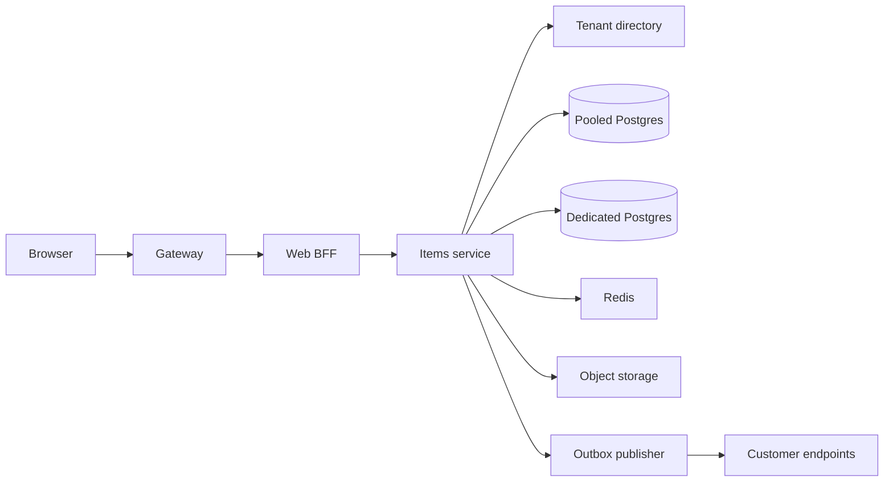

# Multi-tenant B2B SaaS

A work-management product sold to companies. Employees sign in, manage items, upload attachments, and subscribe to webhooks. The vendor operates one product. Tenants must not see each other.

Out of scope: a custom per-tenant code branch, mobile offline sync, and analytics beyond an operational replica.

## Functional requirements

- A tenant admin can connect an OIDC or SAML identity provider, invite users, and assign roles (admin, member, auditor).
- A member can create, update, and list work items in their tenant. A retried create with the same idempotency key returns the original item.
- A member can upload an attachment. The download URL is scoped to that object and expires.
- A tenant admin can register an HTTPS webhook. Item changes are delivered at least once with a signature.
- An auditor can export items for a closed time range.
- An operator can place a tenant in a pooled database or a dedicated database without changing the application code.
- Closing a tenant disables login and deletes or crypto-shreds that tenant's data, including the search index, on the schedule in the contract.

## Non-functional requirements

| Target | Value | Condition |
|---|---|---|
| Interactive read latency | p99 under 300 ms | Home region, item by id, cache hit or primary |
| Create latency | p99 under 400 ms | Ack after the primary commit, not after webhook delivery |
| Availability | 99.9% monthly | Successful item reads and writes, excluding planned maintenance announced 7 days ahead |
| Durability | RPO 0 for acknowledged writes inside the region | Primary plus a synchronous replica in another zone. A write is acknowledged only after that replica has the commit. If the replica is unhealthy, the write is not acknowledged |
| RTO | 60 minutes for a zone loss | With a tested failover |
| Isolation | A bug that forgets an application `WHERE` still must not return another tenant's row | Database row-level security on the pool |
| Webhook lag | p99 under 60 s | After commit, while the tenant endpoint is healthy |
| Retention | 1 year default, 7 years if the contract says so | Then delete, including backups by expiry or by key destruction |
| Residency | Home region is EU or US, chosen at onboarding | No silent cross-region replica |
| Region loss | The product pauses. No cross-region RPO is claimed | Acknowledged bytes stay in the home region. Backup restore is not a stated recovery point |

## Estimates

Given: 5,000 tenants. Assumed: 25 daily active users each, so 125,000 DAU. Assumed: 40 item reads and 4 item writes per DAU. Assumed peak multiplier 5×. Assumed item row 2 KB, attachment average 1 MB, 20 attachments per tenant per day. Assumed 50 tenants on a dedicated database (bridge). The rest are pooled.

- Average item reads = 125,000 × 40 / 86,400 = 57.9 reads/s. Peak reads ≈ 289/s.
- Average item writes = 125,000 × 4 / 86,400 = 5.8 writes/s. Peak writes ≈ 29/s.
- Read egress at peak ≈ 289 × 2 KB ≈ 0.6 MB/s. Not a bandwidth problem.
- Item storage after 3 years. Writes per tenant = 4 × 25 × 365 × 3 = 109,500. All tenants = 5,000 × 109,500 = 547,500,000 writes. At 2 KB (decimal, 2,000 bytes) that is 1.095 × 10^12 bytes = 1.095 TB of rows, about 1.1 TB, before indexes. Index overhead 0.5× makes the primary 1.095 × 1.5 = 1.6425 TB. One intra-region synchronous replica doubles that: 1.6425 × 2 = 3.285 TB, about 3.3 TB. A single primary can hold this. Sharding is not the first move.
- Attachments ≈ 5,000 × 20 × 1 MB = 100 GB/day. Three-year retention ≈ 110 TB in object storage. That is the storage bill.
- Webhook deliveries ≈ write peak 29/s, one HTTP call each, short body. Worker concurrency stays under a few dozen if endpoints respond in under a second. A slow endpoint must not occupy the whole pool.
- 10× peak reads ≈ 2,900/s. Still modest for the app tier. The first bottleneck is a hot tenant's queries on the shared primary, not the mean.

GB above is decimal (10^9) for object storage pricing talk, and the row estimate is the same order either way.

## Component sketch

| Box | Owns | Does not own |
|---|---|---|
| Gateway | TLS, token verification, coarse per-tenant rate limit | Item authorization |
| Web BFF | Browser session cookie, page-shaped aggregation | The item row |
| Items service | Items, authorization checks, attachment metadata | Identity proof (that is the IdP) |
| Tenant directory | Home region, isolation mode, IdP config, key id | Item bodies |
| Postgres | Source of truth for items | Webhook delivery state beyond the outbox row |
| Redis | Cache-aside of item-by-id | Durability |
| Object storage | Attachment bytes | Who may download them. The service signs a short-lived URL |
| Outbox publisher | Reading the outbox and POSTing webhooks | The business decision to emit |

## Component choices

| Concern | Choice | Rejected | Why the rejected one lost |
|---|---|---|---|
| Isolation | Pool plus row-level security. Bridge: dedicated database for tenants that pay for it | Silo account per tenant | 5,000 accounts would dominate operations. Fifty dedicated databases are operable |
| Identity | OIDC authorization code with PKCE. SAML SP when the customer requires it | Passwords for enterprise tenants | Customers already have an IdP. Owning their passwords is a worse risk |
| Authorization | RBAC inside the tenant, permission checks in the items service | ReBAC | The product has roles, not a sharing graph |
| Item store | Postgres, primary plus one sync replica in another zone, for both the pool and each dedicated database | A wide-column store from day one | The access pattern is relational and about 3.3 TB with indexes and the replica still fits one primary |
| Cache | Redis cache-aside, key `tenant:item`, TTL 60 s, delete on write | Write-through | Writes are rare next to reads. A missed delete is covered by the TTL |
| Files | Object storage, SSE with a platform KMS key. Per-tenant data key for bridge tenants | Bytes in Postgres | 110 TB does not belong in the primary |
| Webhooks | Transactional outbox in the item transaction | Publish on the request thread | A crash after commit and before POST would drop events, or a slow endpoint would stall the write |
| Search | Postgres full text for v1, tenant predicate plus RLS | A shared search cluster | Another store to isolate before there is a query the database cannot serve |

## Tradeoffs

- Webhook success is not part of the create latency. A dead customer endpoint lags. The user still has the item. Cost: customers who expect synchronous delivery will be wrong. The admin UI shows the last delivery error.
- Region loss pauses the product. In-region RPO for an acknowledged write is 0, via the synchronous replica. There is no cross-region replica and no cross-region RPO. Cost: no multi-region active-passive yet. The availability target is zonal, and the estimate does not include a second region's bill.
- RLS is the second control behind application predicates. Cost: every new table must enable it. A table that forgets is a review finding, not a silent hope.
- Cache staleness up to 60 s, shorter if the delete lands. A read-your-writes path reads the primary for the writer's own request id for 2 s. Cost: extra primary reads on that path.
- Bridge tenants cost a database each. The unit cost is the reason it is a priced tier, not the default.

## Failure modes and blast radius

| Failure | What stops | What continues | Data |
|---|---|---|---|
| One app instance | Nothing user-visible if the balancer drains it | The rest of the tier | None |
| Redis down | Cache-aside misses | Reads and writes on Postgres | None, latency rises |
| Pooled primary down | Pooled tenant writes until promotion | Bridge tenants on other databases | Acknowledged writes are on the synchronous replica (RPO 0). Unacknowledged writes are not durable. If that replica is unhealthy, the primary does not acknowledge new writes |
| One dedicated database down | That tenant | Everyone else | Same rule on that database: RPO 0 for writes it has acknowledged |
| Outbox publisher down | Webhook lag grows | Item API | Events remain in the outbox |
| IdP down | New logins | Existing access tokens until they expire (15 min) | None |
| Bad items deploy | All tenants on that build | Rollback to the previous digest | Schema is expand-only, so rollback of the binary is safe |

A bug in the pooled query path can affect every pooled tenant. Bridge tenants are outside that blast radius. That is the point of the bridge.

## Design review

Reviewed against [checklist.md](../../pack/skills/design-reviewer/checklist.md). Findings are gaps in this design, ranked from hardest to undo.

### 1. Deletion does not say what happens to backups
- Severity: High
- Area: Data retention and deletion
- Evidence: Retention says "delete, including backups by expiry or by key destruction" and never picks one. Bridge tenants have a per-tenant data key. Pooled tenants share the platform key.
- Why it matters: A restore after a tenant close can bring the tenant's rows back. Crypto-shred only works for tenants whose key is not shared.
- Change: State pooled deletion as row purge plus backup expiry (give the expiry), and bridge deletion as destruction of the tenant key plus purge. Test one restore of each.

### 2. Search is "later" but exports and list filters will need it
- Severity: Medium
- Area: Behavior at 10× load
- Evidence: v1 uses Postgres full text on the primary that also takes writes. The 10× case is 2,900 reads/s plus text search, and the design does not cap search concurrency.
- Why it matters: One tenant's broad search can stall the pool. The mean estimate hides it.
- Change: Put a per-tenant concurrency cap on search and on export, and name the lag budget if search moves to a replica.

### 3. Webhook SSRF controls are unnamed
- Severity: Medium
- Area: Security, mapped to OWASP ASVS 5.0.0
- Evidence: Admins register an HTTPS URL. The design never says private and link-local ranges are blocked.
- Why it matters: A tenant admin can point delivery at the metadata service or an internal admin port.
- Change: Resolve the URL at delivery time and refuse non-public addresses. Re-check on redirect.
- ASVS: V4 API and Web Service, V15 Secure Coding and Architecture

### 4. Cost of 110 TB is not in the decision
- Severity: Low
- Area: Cost
- Evidence: Attachment volume is estimated and no monthly driver (storage class, retrieval, cross-AZ traffic) is named.
- Why it matters: Object storage will be the bill, and a 7-year retention option multiplies it by more than two.
- Change: Add a storage-class and retention line to the capacity worksheet before pricing the enterprise tier.

## Accepted risks

- Single-region deployment. A region outage pauses the product. The SLO says so.
- Webhook delivery is at-least-once. Receivers must dedupe. The product documents the event id.
- SAML is offered, with the checks in [SSO and SAML](../identity/saml-sso.md), but OIDC is the default.
