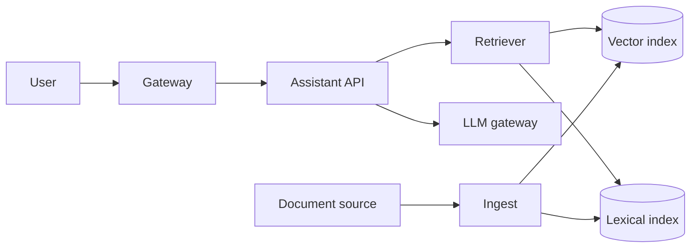

# Multi-tenant RAG assistant

A B2B product adds an assistant. A signed-in user asks a question. The assistant answers from that tenant's documents, cites the passages it used, and must not see another tenant's text or a document the user cannot open.

Out of scope: training a model on customer text, multi-region active-active, and agents that write back into the product. Tool use beyond "search this tenant" is a later design. Decisions behind the boxes are in [RAG](../ai/rag.md), the [LLM gateway](../ai/llm-app-architecture.md), [LLM security](../ai/llm-security.md), and [evals](../ai/evals-and-observability.md).

## Functional requirements

- A tenant admin connects a document source the product already stores. Each document has an ACL of users and groups.
- A member asks a question and receives an answer with citations. Each citation is a chunk id that was in the prompt, with a link the user can open only if they can open the source.
- A retried ask with the same idempotency key returns the stored answer and does not call the generator again.
- An admin deletes a document. The object, chunks, embeddings, lexical postings, and any answer that cited only that document become unreadable. A verification query for that document id returns no chunks.
- An operator can see token counts and estimated spend per tenant. They cannot read another tenant's prompts from the default trace pipeline.
- Closing a tenant disables the assistant and deletes that tenant's derived index on the same schedule as the rest of the tenant data.

## Non-functional requirements

| Target | Value | Condition |
|---|---|---|
| Time to first token | p99 under 2.5 s | Home region, warm model route, retrieval included |
| Full answer | p99 under 12 s | Capped at 350 output tokens |
| Availability | 99.9% monthly | Ask requests that return an answer or a controlled error, excluding announced maintenance |
| Isolation | A query that omits `tenant_id` returns nothing | Predicate comes from the credential, on every index call |
| Freshness | New or updated document searchable within 15 min | While the ingest queue is healthy |
| ACL lag | A revoked user stops matching within 15 min | Principals are copied onto the chunk at ingest |
| Deletion | Object, chunks, embeddings, and postings unreadable within 24 h | Tombstone written before the delete |
| Residency | Index and objects stay in the tenant's home region (EU or US) | Chosen at onboarding |
| Retention | Match the tenant contract, default 1 year for stored answers | Then delete answers, not only documents |

## Estimates

Given: 2,000 tenants. Assumed: 800 documents per tenant, so 2,000 × 800 = 1,600,000 documents. Assumed average document length L = 6,000 tokens. Chunk window C = 500 tokens, overlap O = 50, stride S = C − O = 450. Assumed embedding width 1,536, stored as float32 (4 bytes). These are design assumptions, not a vendor's current defaults.

Window count per document, L > C: ceil((L − C) / S) + 1 = ceil((6,000 − 500) / 450) + 1 = ceil(5,500 / 450) + 1 = ceil(12.222…) + 1 = 13 + 1 = 14. Equivalently ceil((L − O) / S) = ceil(5,950 / 450) = ceil(13.222…) = 14.

- Chunks = 1,600,000 × 14 = 22,400,000.
- Raw float32 embeddings = 22,400,000 × 1,536 × 4 = 22,400,000 × 6,144 = 137,625,600,000 bytes = 137.6256 GB (decimal, 10^9). In GiB: 137,625,600,000 / 1,073,741,824 = 128.173828125 GiB. An ANN index is extra. Size it from the engine. This figure is the matrix only.
- Chunk text, assumed 4 bytes per token (a rough figure for English UTF-8, wrong for other languages): 22,400,000 × 500 × 4 = 44,800,000,000 bytes = 44.8 GB. Store it next to the vectors so citations can quote without another hop to the source.
- One-time embed of the corpus = 22,400,000 × 500 = 11,200,000,000 tokens. At an **assumed** $0.10 per million embedding tokens (substitute your provider's current price): 11,200 × $0.10 = $1,120. Re-embeds on change are incremental, keyed by content hash.

Traffic. Assumed 15 daily active assistant users per tenant: 2,000 × 15 = 30,000 DAU. Assumed 6 questions per DAU: 30,000 × 6 = 180,000 questions/day. Average rate = 180,000 / 86,400 = 25/12 ≈ 2.083 questions/s.

Assumed 80% of questions fall in an 8-hour window: 0.8 × 180,000 = 144,000 questions over 8 × 3,600 = 28,800 s, which is 144,000 / 28,800 = 5 questions/s. Assumed 3× burst inside that window: peak 15 questions/s.

Per question, assumed token mix: system prompt 600, history 800, question 100, context 6 × 500 = 3,000. Input = 600 + 800 + 100 + 3,000 = 4,500 tokens. Output capped at 350. Query embedding = 100 tokens. Total generation tokens per question = 4,500 + 350 = 4,850.

Peak token rate on the generator = 15 × 4,850 = 72,750 tokens/s = 72,750 × 60 = 4,365,000 tokens per minute. Compare that to the provider's current TPM quota before promising the peak. At 10× peak (150 questions/s) the rate is 150 × 4,850 × 60 = 43,650,000 tokens per minute. The first limit is that quota and the bill, not the vector query rate. 15 searches/s, or 150 at 10×, is modest for a filtered index of this size. A hot tenant is the shape that hurts, not the mean.

Prices below are **assumed**. They are not a vendor's price. Substitute the current price per million tokens.

- Input: $2.50 per million. One question: 4,500 / 1,000,000 × 2.50 = $0.01125.
- Output: $10 per million. One question: 350 / 1,000,000 × 10 = $0.0035.
- Embeddings: $0.10 per million. One question: 100 / 1,000,000 × 0.10 = $0.00001.
- Per question = 0.01125 + 0.0035 + 0.00001 = $0.01476.

A 30-day month at 180,000 questions/day is 180,000 × 30 = 5,400,000 questions.

- Input tokens = 5,400,000 × 4,500 = 24,300,000,000. Cost = 24,300 × $2.50 = $60,750.
- Output tokens = 5,400,000 × 350 = 1,890,000,000. Cost = 1,890 × $10 = $18,900.
- Embedding tokens = 5,400,000 × 100 = 540,000,000. Cost = 540 × $0.10 = $54.
- Month = 60,750 + 18,900 + 54 = $79,704. Check: 5,400,000 × 0.01476 = 79,704.
- 10× traffic, same mix, is 10 × 79,704 = $797,040 per month, before retries and before ingest.

## Component sketch

| Box | Owns | Does not own |
|---|---|---|
| Gateway | User auth, tenant from the credential, per-tenant request cap | Which chunks match |
| Assistant API | Idempotency, budgets, citation records | The model provider credential |
| Retriever | Tenant and ACL filters, hybrid fusion, rerank call | The source object |
| Vector and lexical indexes | Derived chunks | Authorization decisions beyond the filter they were given |
| LLM gateway | Model route, max tokens, provider failover, spend log | Whether the cited chunk was allowed |
| Ingest | Chunk, embed, tombstones | Live queries |

## Component choices

| Concern | Choice | Rejected | Why the rejected one lost |
|---|---|---|---|
| Isolation | One pooled index. Retriever sets `tenant_id` from the credential. Same filter on the lexical query | A silo index per tenant | 2,000 indexes to operate. The pool still needs an engine-side rejection of a query that drops the predicate. This design does not have that rejection |
| Retrieval | BM25 and vector, fused with reciprocal rank fusion, then a reranker on the top 50, then 6 chunks in the prompt | Vector only | Identifiers and exact phrases are common in this corpus and embeddings miss them |
| ACL | Principals copied onto the chunk at ingest. Query filters that list | Query-time join to the live ACL | Copied lists keep the query inside one index. They go stale. The review rejects the lag |
| Generator | Gateway, pinned model id, cap 350 output tokens, exact-match cache keyed by tenant, model, template version, and retrieved chunk ids | Semantic cache | A near miss across documents is a wrong answer, and a shared semantic cache is a leak |
| Embeddings | One pinned model, 1,536-d float32 | Mixing a second model in the same index | Vectors from different models are not one space |
| Deletion | Delete object, chunk rows, vectors, and postings. Tombstone so a late ingest event cannot rewrite them | Soft-delete flag the retriever must remember | A missed flag is a read of deleted text |

## Data model

| Record | Key | Notes |
|---|---|---|
| Document | tenant_id, document_id | Source pointer, content hash, version, current ACL |
| Chunk | tenant_id, chunk_id | document_id, ordinal, text, token count, source version, copied principal ids |
| Embedding | chunk_id in the vector index | Model id and dimension are part of the index name. Payload repeats tenant_id |
| Tombstone | tenant_id, document_id | deleted_at. Ingest drops events for this id |
| Answer | tenant_id, answer_id | User, idempotency key, model id, template version, cited chunk ids, token counts |
| Eval case | dataset version, case id | Must not outlive the document it was built from |

## Tradeoffs

- Citations are chunk ids that were in the prompt. That makes a clickable source. It does not prove the sentence follows from the chunk. Groundedness is an eval, not a field on the row.
- The exact-match cache can serve an answer for the TTL after a document changes, unless the chunk-id fingerprint misses. Deletes go through the tombstone path and drop cache keys for that document. Updates wait for the TTL or for the fingerprint change. The product accepts up to the freshness target for updates.
- Failover to a second generator is allowed only when that model is on the route's capability list. A different model is a different answer. The stored row records which id ran.
- Region loss pauses the assistant. No cross-region RPO is claimed for the index. Rebuild is a re-embed: 11,200,000,000 embedding tokens, $1,120 at the assumed $0.10 per million, plus the time to re-read 1,600,000 documents.

## Failure modes and blast radius

| Failure | What stops | What continues | Data |
|---|---|---|---|
| One API instance | Nothing user-visible if the balancer drains it | The rest of the tier | None |
| Embedding provider down | Ingest of new documents | Answers on the existing index | New documents stay outside the index until the queue drains |
| Generator down, no healthy fallback | New answers | Citations of stored answers, the rest of the product | In-flight calls that the provider accepted may still be billed. The idempotency key blocks a second call |
| Vector index down | New answers | Ingest queues | None if the index is a replica set with a tested restore. A single copy is a review finding |
| Bad ingest deploy | Index updates | Previous chunks still queryable if the new version is not committed | A poison document is quarantined by id, not by stopping the pipeline |
| One hot tenant | That tenant, once its token bucket is empty | Other tenants, while the global TPM remains | Spend is attributed to the tenant. The monthly cap's number is not set in this design |

## Design review

Reviewed against [checklist.md](../../pack/skills/design-reviewer/checklist.md). Findings are gaps in this design.

### 1. The tenant filter is only in the retriever
- Severity: High
- Area: Isolation, mapped to OWASP ASVS 5.0.0
- Evidence: The choice is a pooled index. The retriever "sets `tenant_id` from the credential." Nothing in the engine rejects a query that forgets the predicate. The isolation target still says a query that omits `tenant_id` returns nothing.
- Why it matters: One bug sends another tenant's chunks to the reranker and the generator. The model cannot put that text back.
- Change: Partition by tenant, or an index policy that rejects a query missing the tenant predicate taken from the credential. Add a test that drops the predicate and expects zero hits.
- ASVS: V8 Authorization, V14 Data Protection

### 2. Deletion does not name the copies that matter later
- Severity: High
- Area: Data retention and deletion
- Evidence: Deletion names the object, chunks, embeddings, postings, and answers that cited only that document. The tradeoff drops exact-match cache keys on delete. Eval cases and backups are not named. An answer that cites the deleted document together with another still stores the passage.
- Why it matters: A restore can bring the vectors back, and an eval file is a second copy of customer content. A mixed answer still quotes the deleted passage. See [retention](../compliance/retention.md).
- Change: One workflow writes the tombstone, then deletes every derivative including answer rows, cache keys, and eval cases. Backups expire inside the contract window or cannot restore into a serving index without the tombstone. The verification query covers each store.

### 3. Copied ACLs and the model region break the promises next to them
- Severity: Medium
- Area: Authorization and residency
- Evidence: Principals are copied onto the chunk, and the ACL target allows 15 minutes of continued access after revocation. The residency target covers the index and the objects. The reranker and the generator receive passage text and have no stated region or retention setting.
- Why it matters: A user removed from a group keeps retrieving until the next ingest. A subprocessor outside the home region is a copy the contract may forbid.
- Change: Filter with the live ACL, or publish the lag and measure it. Name the reranker and the model as subprocessors, with region and retention. If the contract says the home region, those calls run there.
- ASVS: V8 Authorization, V14 Data Protection

### 4. The $79,704 estimate has no alarm
- Severity: Medium
- Area: Cost, and behavior at 10×
- Evidence: The month is $79,704 at the assumed prices, and 10× traffic is $797,040. Peak is 4,365,000 tokens per minute before the 10× case. No per-tenant monthly token cap is in the component table, and no alert fires when spend leaves the estimate.
- Why it matters: One tenant's long history, or a client that retries without the idempotency key, spends the shared TPM. The mean rate of about 2 questions/s hides it.
- Change: A per-tenant token quota, a gateway alarm at 2× the assumed monthly run rate, and a load test at 4,365,000 tokens per minute against the provider quota you actually have.

## Accepted risks

- Single-region index. A region outage pauses answers. Rebuild is a re-embed, not a replica promotion.
- Update freshness can be as long as the 15-minute ingest target plus the answer-cache TTL. Deletes do not wait on that TTL.
- Assumed prices ($2.50, $10, and $0.10 per million tokens) are placeholders. Replace them before anyone uses this page to forecast a real invoice.
- The assistant does not write to the product. Adding tools is a new design, under [agents and tools](../ai/agents-and-tools.md), not a flag on this one.

## Sources

- [RAG](../ai/rag.md), [LLM application architecture](../ai/llm-app-architecture.md), [evals and observability](../ai/evals-and-observability.md)
- [NIST AI 600-1](https://www.nist.gov/publications/artificial-intelligence-risk-management-framework-generative-artificial-intelligence)
- Reciprocal rank fusion (Cormack, Clarke, and Buettcher, SIGIR 2009): <https://plg.uwaterloo.ca/~gvcormac/cormacksigir09-rrf.pdf>
