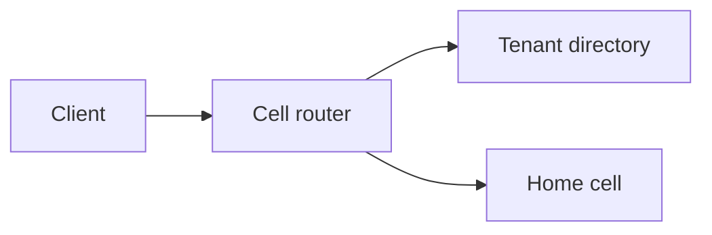

# Cell-based architecture

A cell is one full copy of the stack that serves a subset of the workload: the services, the data stores, and the queues for that subset. Cells do not share that state. A bad release, a full disk, or a hot tenant stays inside the cell that holds it.

A database shard with a shared stateless fleet is not a cell. The fleet is still one failure domain. Shuffle sharding, below, is a different tool: overlapping assignments inside one pool, not a hard wall. Region placement is [multi-region](multi-region.md). Tenant home is [routing](../tenancy/routing.md).

AWS writes this up as cell-based architecture guidance. That page is on docs.aws.amazon.com, so this guide links it and does not copy it. See [Sources](#sources).

## Decide

| Approach | Use when | Avoid when |
|---|---|---|
| Full cells | A failure domain must include the data store, and you can pay for several minimum-size stacks | Every request joins or transacts across all tenants. The cell wall is then a fiction |
| Shuffle sharding | Workers or queues stay in one pool, and you want few tenants to share an identical subset | The pool itself is down. Overlap does not help if every node is gone |
| One deployment | One failure domain is an accepted risk and the team will not operate N stacks | The contract says one tenant's outage stops at that tenant |

## Defaults

- The cell router is a lookup and a forward. It reads the tenant's cell from a directory, then sends the request only there. It does not contain product rules, and it does not call every cell to see who answers.
- Cache the routing decision at the edge with a short TTL. A control-plane blip must not fail data-plane calls that already know their cell. Reject or proxy a request that lands on the wrong cell. Do not write it there.
- Control plane is placement, provisioning, the directory, and deploy orchestration. Data plane is the request path inside the cell. Keep them apart so a control-plane deploy is not a data-plane deploy.
- Place a new tenant into a cell that has spare capacity and the right [residency](../compliance/residency.md). Cap how much of the product one cell may hold, in tenants and in requests, not only in servers.
- Moving a tenant is a migration: copy, catch up, freeze or dual-write, flip the directory, drain in-flight work, check counts, delete the source. One writer cell at a time. [Routing](../tenancy/routing.md) says the same thing.
- Deploy by cell, in waves. A wave is a few cells, then a bake against that wave's SLO, then the next wave. [Progressive delivery](../delivery/progressive-delivery.md) is the same idea one level down, inside a cell.
- Size the cell for a fixed maximum. Growth past that is another cell, not a larger database in the same cell.



## Shuffle sharding

Shuffle sharding assigns each tenant a small subset of a shared pool. The subsets overlap, but identical subsets are rare, so one tenant's poisoned nodes are not everyone's nodes.

With `n` nodes and shard size `k`, the number of distinct shards is the combination

```text
C(n, k) = n! / (k! * (n - k)!)
```

Example: `n = 8` nodes, `k = 2`.

```text
C(8, 2) = (8 * 7) / (2 * 1) = 28
```

There are 28 possible shards. If each tenant is assigned uniformly at random among those 28, the chance that a second tenant draws the exact same pair is `1/28`.

One node down touches every shard that includes it:

```text
C(7, 1) = 7
7 / 28 = 1/4
```

Those 7 shards still have their other node. Tenants on them lose half that shard's capacity. They are not fully dark unless the shard required both nodes.

Two specific nodes down, still with `k = 2`:

```text
Fully dark (both members failed): C(2, 2) = 1
Degraded (exactly one member failed): C(2, 1) * C(6, 1) = 2 * 6 = 12
Untouched: C(6, 2) = (6 * 5) / 2 = 15
1 + 12 + 15 = 28
```

One shard in 28 is fully down. Twelve are degraded. Fifteen are untouched.

A hard split of the same 8 nodes into 4 fixed pairs is different: one node failure darkens the whole pair, which is `1/4` of tenants with no remaining member. Shuffle sharding buys that difference only while the shard can serve on a surviving member. It does not isolate the database, the deploy, or a bug in shared code. Those want a cell.

Changing `n` or `k` changes the combination space. A hash into that space moves many tenants. Treat that move like a reshard, or store the assignment explicitly when you need to drain one node.

The AWS Builders' Library article on shuffle sharding is linked below and is not copied here.

## Cell sizing

Planning target: peak demand `P = 180,000` requests/s. Losing one cell may remove at most 10% of capacity, and the cells that remain must still serve the peak. Cells are equal.

Loss fraction is `1/N`, so `1/N ≤ 0.10` means `N ≥ 10`. Take `N = 10`.

Each cell's steady load:

```text
P / N = 180,000 / 10 = 18,000 requests/s
```

Capacity of one cell, so nine survivors still cover the peak:

```text
C = P / (N - 1) = 180,000 / 9 = 20,000 requests/s
```

Steady utilization:

```text
18,000 / 20,000 = 0.90
```

Spare on each cell is `1/N = 0.10`. That spare exists only because you built each cell for `20,000` while it runs at `18,000`. Adding cells and shrinking them to the same rule does not create extra spare: with `N = 12`, loss fraction and spare are both `1/12`.

Placement has to match the cap. A cell built for 10% of capacity that holds 30% of tenants still fails 30% of the product. Waves: 12 cells in waves of 3 expose `3/12 = 0.25` of cells at a time. Stop the train when that wave misses its SLO.

## Checklist

- [ ] A cell failure list names the services, data stores, and queues that die with it, and the tenants that live there.
- [ ] The router has no product logic. Wrong-cell requests are rejected or proxied, not written.
- [ ] Directory updates and data-plane deploys are separate pipelines.
- [ ] Tenant moves have a freeze or dual-write, a directory flip, and a check before the source is deleted.
- [ ] Deploy waves are smaller than the fleet, with a bake and an abort.
- [ ] The per-cell maximum is written down in requests and in tenants.

## Anti-patterns

- Calling a shared app tier in front of sharded databases "cells."
- A router that fans out to every cell, or that embeds checkout rules.
- Shuffle sharding as a substitute for isolating a destructive deploy.
- Growing the busiest cell's database instead of opening another cell.
- One pipeline that restarts every cell in the same minute.
- A control-plane outage that drops data-plane calls because nothing cached the route.

## Related

- [Multi-region](multi-region.md), [disaster recovery](disaster-recovery.md), [bulkheads](circuit-breaker-bulkhead.md), [SLOs](../observability/slos.md)
- [Tenant routing](../tenancy/routing.md), [isolation](../tenancy/isolation-models.md), [noisy neighbors](../tenancy/noisy-neighbor.md), [residency](../compliance/residency.md)
- [Progressive delivery](../delivery/progressive-delivery.md), [bulkhead](../../patterns/bulkhead.md), [sharding](../../patterns/sharding.md)

## Sources

- [Reducing the Scope of Impact with Cell-Based Architecture](https://docs.aws.amazon.com/wellarchitected/latest/reducing-scope-of-impact-with-cell-based-architecture/reducing-scope-of-impact-with-cell-based-architecture.html) (link only)
- [Workload isolation using shuffle-sharding](https://aws.amazon.com/builders-library/workload-isolation-using-shuffle-sharding/) (link only)
