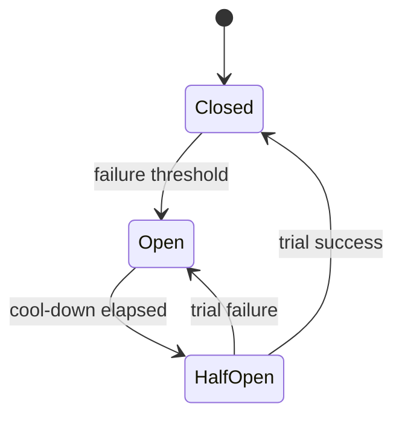

# Circuit breakers and bulkheads

Retries keep trying. A circuit breaker stops trying for a while. A bulkhead limits how much of your process that dependency is allowed to occupy. You usually want both.

## Circuit breaker

| State | Behavior |
|---|---|
| Closed | Calls go through. Failures count |
| Open | Calls fail immediately in the client, for a cool-down. The dependency gets room to recover |
| Half-open | A few trial calls go through. Success closes the circuit. Failure opens it again |

Trip on a rate (for example, more than half of calls failing in a short window) or on consecutive failures, over a minimum volume so one error does not open the circuit. Opening should be fast relative to user patience and slow enough to ignore a single blip.

When the circuit is open, return a controlled error or a stale cached result you have declared acceptable. Do not block.

## Bulkhead

- Give each dependency its own concurrency limit or connection pool. If payments is stuck, search still has threads.
- Isolate queues the same way: a shared worker pool with no fair-share is one bulkhead-shaped accident.
- Set the limit from the dependency's real capacity, not from the size of your thread pool. Extra client threads do not make a sick database faster.
- Per-tenant bulkheads are how you keep a noisy tenant off the shared pool. See [noisy neighbors](../tenancy/noisy-neighbor.md).

## Defaults

- Timeouts fire before the bulkhead is exhausted by waiters. A small pool of calls that each hang for minutes is the failure mode.
- The breaker wraps one dependency, not the entire outbound HTTP client. A payments outage should not open the circuit for the identity provider.
- Metrics: state, rejection count, in-flight per bulkhead. Alert when a breaker stays open, and when a bulkhead is saturated while users still need that feature.
- Document the user-visible behavior while open ("checkout returns 503", "feed shows the last cached page").
- Half-open trials are few. A thundering retry when the circuit closes recreates the outage. Pair with jittered retries.

Pattern cards: [circuit breaker](../../patterns/circuit-breaker.md), [bulkhead](../../patterns/bulkhead.md).

## Anti-patterns

- A breaker that opens and whose clients immediately retry another replica with the same storm.
- One shared unbounded thread pool called a bulkhead.
- Tripping on business errors (`404`) as if the dependency were down.
- A manual "breaker" that is a config flag nobody is on-call to flip. Automation can exist alongside a flag. It should not depend on a sleeping human for the first minute.
