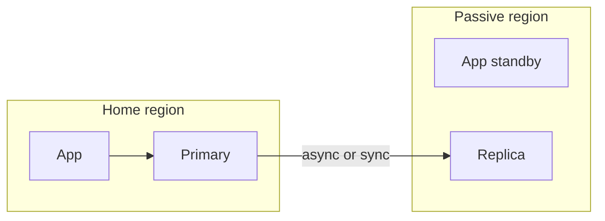

# Multi-region architectures

Two regions cost real money and real consistency complexity. Add a second region because the RTO or a residency rule requires it, not because a diagram looks mature.

The Primer's active-passive and active-active failover notes are the short version. This page is the data-placement version. Pattern card: [availability and failover](../../patterns/availability-failover.md).

## Decide

| Topology | Use when | Avoid when |
|---|---|---|
| Single region, multi-zone | A zone loss is the disaster you must take, and a region loss may pause you | The contract says the product stays up when the whole region is gone |
| Active-passive | One region serves writes. The other has a replica or a warm stack you can promote | You need both regions to take writes in steady state, or RPO must be zero and you will not pay for synchronous commit |
| Active-active, read local / write home | Users read nearby, but each tenant or each record has a home region for writes | Clients write the same key in two regions. You just built conflicts |
| Active-active, both regions write | The workload partitions cleanly (different keys, or CRDTs / explicit merge) and you can operate conflicts | You need ordinary unique constraints or payments. Prefer a single writer per key |

## Defaults

- Each tenant or each aggregate has a home region. Routing sends writes there. See [tenant routing](../tenancy/routing.md).
- Replication lag is an SLO for reads that are allowed to be stale, and a blocker for failover if the RPO is smaller than the lag.
- Promotion fencing: after failover, the old region must not accept writes. DNS TTL, lease, and database role change are all part of fencing. One of them flipping is not enough.
- Idempotency keys and unique constraints are how you survive "both sides briefly wrote." See [idempotency](../data/idempotency.md).
- Region-local dependencies (queues, object storage, KMS) must fail over with the data or you will promote a database that cannot read its blobs.
- Residency wins over a pretty active-active map. See [residency](../compliance/residency.md).
- Practice failover. An untested passive region is a backup you hope restores, filed under a more expensive name.

## Checklist

- [ ] The design says who accepts writes for a given key during a partition.
- [ ] RPO is compared to measured replication lag, not to the vendor's brochure.
- [ ] Failover steps name DNS, database role, queue, and KMS.
- [ ] Clients retry safely during the minutes when both sides might have been unsure.
- [ ] Cost of the second region is in the estimate, including cross-region egress.

## Anti-patterns

- Active-active application servers with a single-region database, described as multi-region active-active.
- Last-write-wins on a counter, a balance, or a permission bit.
- A global unique index that only exists in one region.
- Health-check failover that flaps because the check is stricter than user traffic.
