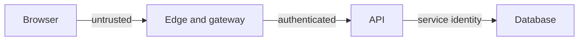

# Threat modeling with STRIDE

A threat model is a list of abuses tied to specific elements in the design, each with a mitigation you will actually build or an accepted risk you will write down. It is not a taxonomy exercise.

Use the copyable worksheet at [templates/threat-model.md](../../templates/threat-model.md).

## STRIDE

| Threat | Question | Typical mitigation |
|---|---|---|
| Spoofing | Can a caller pretend to be a user, tenant, or service? | Authenticate every caller. Bind tenant to the credential. See [service identity](../identity/service-to-service.md) |
| Tampering | Can data or a message change in transit or at rest without detection? | TLS, signed webhooks, integrity on audit records, parameterized writes |
| Repudiation | Can someone do a privileged action and later deny it? | Append-only audit with actor, object, time, and source. See [audit logs](../compliance/audit-logs.md) |
| Information disclosure | Can a caller read another tenant's data, a secret, or excess fields? | Authorization on every read, encryption, redaction in logs, field allow-lists |
| Denial of service | Can one caller exhaust a shared resource? | Timeouts, limits, bulkheads, load shedding. See [load shedding](../reliability/load-shedding.md) |
| Elevation of privilege | Can a normal user become an admin, or a service call an admin API? | Server-side authorization, separate admin permissions, no client-supplied role |

## How to walk the design

1. Draw boxes: external entities, processes, stores, data flows. Mark trust boundaries (browser to edge, tenant to tenant, service to datastore, CI to production).
2. For each flow that crosses a boundary, ask the six questions. Write one row per real abuse, not one row per letter by habit.
3. Mark each row mitigated (name the control), accepted (name the owner and the residual harm), or open (blocks release if the harm is cross-tenant disclosure or silent data loss).
4. Revisit the model when the boundary changes. Do not maintain a model that no longer matches the diagram.

## Defaults

- Start with the flows that touch credentials, tenant data, money, or admin actions. Skip the health check until the rest is done.
- Severity follows impact and how exposed the flow is, not how clever the attack sounds.
- Mitigations are design changes or existing controls you can point at. "Use a WAF" is not a mitigation for a missing authorization check.
- Pair the model with the [design review checklist](../../pack/skills/design-reviewer/checklist.md). The checklist is the review; the threat model is the input that makes spoofing and disclosure concrete.

## Anti-patterns

- A STRIDE table generated once and never tied to a component.
- Accepting "insiders are trusted" on a multi-tenant system.
- Modeling only the happy-path diagram and ignoring the admin tool, the export job, and the backup.
- Treating a passed penetration test as a substitute for a model of a feature the test did not cover.
