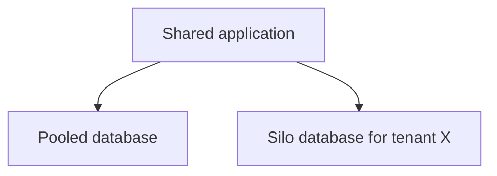

# Tenant isolation models

Isolation is a spectrum of shared fate. The model answers: what can one tenant's bug, load, or subpoena do to another tenant.

## Decide

| Model | What is shared | Use when | Avoid when |
|---|---|---|---|
| Silo | Almost nothing above the account or cluster. Own database, often own keys, sometimes own deployment | Regulated tenants, contractual isolation, or a tenant large enough to fund the extra cost | The long tail of small tenants. Cost and operational load grow linearly |
| Pool | Application, database, and usually schema. A `tenant_id` column (or equivalent) on every row | Many small tenants, similar load, one product version | A single bug in a `WHERE` clause is an unacceptable cross-tenant leak, and you will not back it with a second control |
| Bridge | Shared application, separate database or schema for some tenants; the rest stay pooled | Most tenants are small, a few are large or picky | You silo by accident (one schema per tenant for thousands of tenants) and operations fall over |

Pick the default pool unless a requirement forces a silo. Offer bridge as an explicit upgrade, not as a one-off snowflake.

## Defaults

- Tenant id is chosen at authentication and carried in the credential. Every query includes it.
- A second control backs the application filter: database row-level security, a per-tenant schema, or a separate database. One missed predicate should not be the only barrier.
- Ids are unguessable or authorization-checked. Sequential ids plus a missing filter are a scraping bug.
- Connection pools, caches, and queues are either partitioned by tenant tier or capped per tenant. See [noisy neighbor](noisy-neighbor.md).
- Caches key every entry by tenant. A shared "user:42" key is a leak.
- Background jobs load the tenant id from the job row, not from a default.
- One code path serves silo and pool tenants if you can, with the store handle selected by tenant record. Two products will drift.

## Checklist

- [ ] You can state, for each store, whether two tenants can see each other's rows if one query forgets the predicate.
- [ ] A test tenant pair tries cross-tenant read and write in CI.
- [ ] Admin tools require a tenant context and audit the access.
- [ ] The isolation model is a per-tenant setting, so a noisy or regulated tenant can move without a rewrite.

## Anti-patterns

- A shared database user that owns every schema, used by every service, called "isolation" because the schemas are named by tenant.
- Caching HTML or JSON that includes tenant data on a CDN URL with no tenant-binding signature.
- Logging full request bodies from every tenant into one shared debug sink that support staff can search across.
- Assuming a separate Kubernetes namespace is isolation when the node, the datastore, and the CI role are shared.
