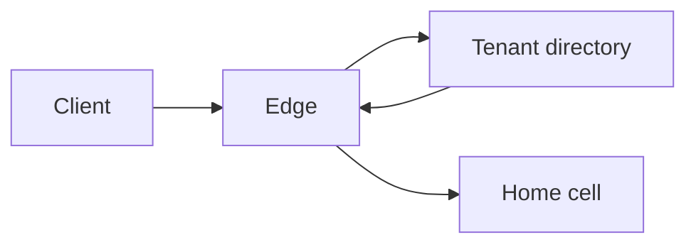

# Tenant-aware routing

Routing decides where a request is allowed to run. The tenant's home is a property you store, not a header the client may set freely.

## Defaults

- Map the public host (or the SSO issuer) to a tenant as a hint. After login, the tenant in the token must match that hint. Mismatch is a failed login, not a redirect the attacker chooses.
- Stamp `home_region` or `cell` on the tenant record. Edge routing reads that stamp from a directory you operate, then forwards.
- Data-plane calls carry the tenant. The service checks that this deployment is allowed to serve that tenant. A wrong-region request is rejected or proxied, and you pick one. Silent acceptance writes data in the wrong place.
- Sticky sessions are not tenancy. Any instance in the cell can serve the tenant.
- Connection strings and schema names come from the tenant directory, cached with a short TTL, and invalidated on move.
- Admin and support tools route explicitly. They do not "default" to tenant A because the header was missing.
- Moves between cells are a migration with a cutover, a freeze, or a dual-read plan. They are not a DNS flip that races in-flight writes.

## Decide

| Signal | Trust it | Do not trust it |
|---|---|---|
| Token tenant claim | Yes, after you validate the token | Before signature and audience checks |
| Host name | As a routing hint once it matches the token | As the only tenant id |
| Request body `tenant_id` | Never for authorization | Even for "convenience" on a shared endpoint |
| Source IP | For abuse control | For which tenant this is |

## Checklist

- [ ] A request with tenant A’s token to tenant B’s host fails.
- [ ] Directory downtime has a defined behavior: cached routes keep working for a bounded time, or the edge fails closed.
- [ ] You can list which cell holds a tenant in one place.
- [ ] Metrics are labeled by cell and can be broken down by tenant tier without putting unbounded tenant ids on every high-cardinality metric. Use logs or exemplars for the single tenant.

## Anti-patterns

- A global anycast API that writes to whichever region was closest and calls that "multi-region."
- Encoding the cell only in a cookie the client can edit.
- High-cardinality tenant id on every histogram, blowing up the metrics bill and the memory of the scraper.
