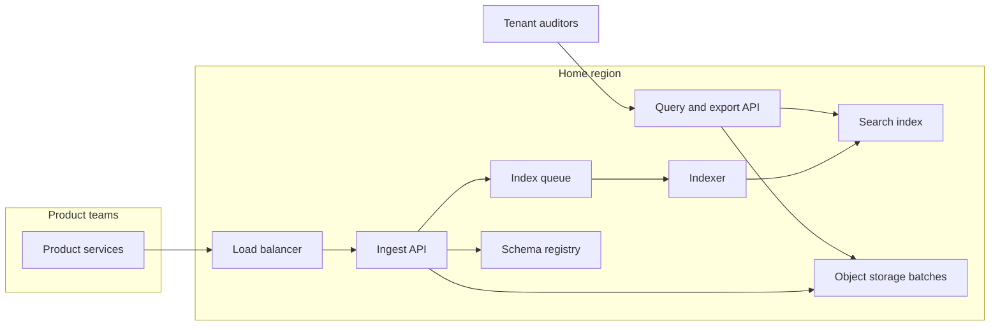

# Multi-tenant audit log

Output of the system-architect skill for the request in [README.md](README.md).

Customers are companies (tenants) on a B2B platform. Product services emit an event when a person or a job changes a resource. Tenant security staff search recent history and export a closed time range. The platform team runs the log. Product teams emit into it.

Out of scope: a SIEM product, full-text search of arbitrary business documents, and replacing each product's own database.

## Functional requirements

- A product service can append a batch of events. A retried batch with the same client batch id returns the original acknowledgement and does not write a second copy.
- An event records tenant, actor, action, resource type, resource id, source service, time the action happened, and a JSON payload the source service supplies.
- A tenant auditor can list events for their tenant by time range, and can filter by actor, action, or resource. They cannot query another tenant, including by guessing an id.
- The same auditor can request an export of a closed time range. The export is built from the source of truth, not from the search index, and is delivered as an object the auditor can download.
- An operator can set a tenant's retention to 1 year (default) or 7 years, and can place a legal hold that stops deletion for that tenant.
- After the service acknowledges a batch, a later export of that time range includes those events.

## Non-functional requirements

- Ingest acknowledgement p99 under 200 ms inside the tenant's home region, at the peak below.
- Interactive queries p99 under 1 s for a selective filter over the last 90 days. Queries may lag ingest by up to 60 s.
- Acknowledged events are durable inside the home region across an instance or zone loss. A region loss may pause ingest for tenants homed there; it must not destroy acknowledged events that are inside the retention window. (The design only partly meets this; see Tradeoffs.)
- Availability target for ingest acknowledgement: 99.9% per month in the home region (Primer downtime: about 44 minutes in a month).
- Tenant isolation is a correctness requirement, not a best effort.
- Payloads are encrypted in transit (TLS) and at rest (provider encryption on the bucket and the index).
- The platform on-call can tell, for a batch id, whether it was acknowledged.

## Estimates

Assumptions, marked.

- Given: 2,000 tenants, 50 million events/day across all of them, two regions.
- Assumed: 2,000 bytes per event (decimal KB, so the daily total stays round). Peak is 5× the daily average. That multiplier is not measured.
- Assumed: 20 interactive queries/s average, 100/s peak, each returning at most 100 events (200 KB).
- Assumed: 90% of events retained 365 days, 10% retained 7 years, once the tenant flag is set. Hot search index keeps 90 days.
- Assumed: search index overhead is 0.5× the raw bytes, plus one replica (two copies on disk). Object storage is counted as logical bytes; multi-AZ durability is the provider's, not three disks this design operates.

Arithmetic:

- Average ingest = 50×10^6 / 86,400 = 578.7 events/s.
- Peak ingest = 578.7 × 5 = 2,894 events/s, rounded to 2,900/s below.
- Stored per day = 50×10^6 × 2,000 = 1.0×10^11 bytes = 100 GB/day.
- Ingress average = 1.0×10^11 / 86,400 ≈ 1.16 MB/s. Peak ingress ≈ 5.8 MB/s.
- Query egress peak = 100 × 200 KB = 20 MB/s. Small next to ingest storage.
- Hot raw = 100 GB × 90 = 9 TB. With 0.5× overhead = 13.5 TB primary. With one replica = 27 TB.
- Cold steady state, after year 7: 0.9 × 100 GB × 365 = 32,850 GB (32.85 TB) on the one-year tier, plus 0.1 × 100 GB × 365 × 7 = 25,550 GB (25.55 TB) on the seven-year tier. Together 58.4 TB logical in the home region. Decimal TB, 1 TB = 1,000 GB. The other region stores an asynchronous copy of the seven-year prefix only, another 25.55 TB. Object bytes this design stores are 58.4 + 25.55 = 83.95 TB. The one-year tier is not in that copy.

The bottleneck at this size is not bandwidth. It is per-tenant ordering and the operational promise that an acknowledgement means the bytes are in object storage. 2,900 events/s of 2 KB is a modest stream for a log or an object store. The design still partitions, because a single writer process would be the availability risk, not because the bytes require it.

Latency budget on the ingest path: TLS and load balancer (sub-millisecond in region), auth check (a cached token lookup, treat as one same-datacenter round trip, 0.5 ms class), one object PUT of a small batch. A same-region PUT of a few hundred KB fits the 200 ms p99 if batches stay under about 500 events or 1 second, whichever comes first. A cross-region PUT does not fit, which is why a tenant has a home region.

## Component sketch

- **Ingest API.** Stateless, several instances behind the load balancer. Authenticates the calling service, checks the tenant in the credential, validates the batch, writes one immutable object per batch, enqueues an index job, then acknowledges. It does not serve reads.
- **Object storage.** Source of truth for acknowledged batches. Key: `tenant/yyyy/mm/dd/<batch_id>`. A manifest holds the event ids and a hash of the previous batch for that tenant.
- **Index queue and indexer.** Build the 90-day search projection. A sweeper lists manifests that have no index marker and re-enqueues them, so a lost queue message does not lose the event.
- **Search index.** Derived. Rebuildable from the bucket. Not a source of truth.
- **Query and export API.** Only path that should read the index. Exports read the bucket for the closed range and write a new object in an export prefix.
- **Schema registry.** Maps a schema id to a version. Consulted on ingest.

Each tenant is pinned to a home region. The other region receives an asynchronous copy of the seven-year prefix only. Ingest for a tenant always goes to the home region. Failover of the home region is a manual promotion, target 15 minutes, and is not built in this design.

## Data model

**Batch object** (source of truth, immutable once written):

| Field | Notes |
|---|---|
| batch_id | Client-supplied. Idempotency key, unique per tenant. |
| tenant_id | Must match the credential. |
| received_at | Ingest clock. |
| prev_hash | Hash of the previous batch manifest for this tenant, or empty for the first. |
| events | Array of the event fields below. |

**Event** (inside the batch, and as a document in the index):

| Field | Notes |
|---|---|
| event_id | Client-supplied, unique per tenant. |
| occurred_at | When the action happened, caller's clock. |
| actor_id, actor_type | Person or service. |
| action, resource_type, resource_id | Filter columns. |
| source_service | Which product emitted it. |
| schema_id | Optional. Unknown ids are stored and labeled `unregistered`. |
| payload | JSON object. A batch is refused over 500 events or 1 MB. |

**Tenant config:** `tenant_id`, `home_region`, `retention` (`1y` or `7y`), `legal_hold` boolean.

**Daily root:** object `roots/yyyy-mm-dd` in the same bucket, containing the hash of that day's last manifest per tenant. Written by a nightly job.

Consistency: the bucket write is the commit. Once the PUT succeeds and the acknowledgement is sent, a reader of the bucket sees the batch (strong for "was it stored"). The search index is eventual, target lag 60 s, which matches the query NFR. Replication to the second region is asynchronous and covers only the seven-year prefix.

Partitioning: the index and the queue are partitioned by `tenant_id`, 32 partitions. The hash chain is per tenant, so ordering does not depend on a global primary. This is sharding by tenant, with the hot-key risk the Primer describes left as a known possibility and not given a special case.

Cache strategy: the index is a projection, not cache-aside. Invalidation is a rebuild from the bucket. There is no write-behind of the source of truth. The idempotency table (batch_id seen in the last 24 h) is cache-aside in Redis in front of a small table, TTL 24 h, and a duplicate that misses the cache falls through to a conditional create on the object key, which fails if the key exists.

## API

Callers are product services (ingest) and tenant auditors (query and export). Services use the platform's workload identity. Auditors use the existing OIDC login. The tenant id on a write or a read is the tenant in the credential.

| Call | Behavior |
|---|---|
| `POST /v1/batches` | Body: batch_id, events. `202` with `{batch_id, received_at}` after the object PUT. Same batch_id and same body returns the same `202`. Same batch_id and a different body returns `409`. |
| `GET /v1/events` | Query: `from`, `to`, optional `actor_id`, `action`, `resource_id`, page cursor. Served from the index. Page cursor is `(occurred_at, event_id)`. |
| `POST /v1/exports` | Body: `from`, `to`. `202` with an export id. Job reads the bucket. |
| `GET /v1/exports/{id}` | Status, then a download URL when the object is ready. |
| `PUT /v1/admin/tenants/{id}` | Retention and legal hold. Platform operators only. |

Errors a caller retries: `429` and `503`, with backoff. `409` is not retried with the same body. `401` and `403` are not retried.

## Tradeoffs

- **Object storage as the commit point, search index as a projection.** Rejected: a single database as both the log and the query engine. At 100 GB/day the database becomes a capacity project, and a query workload would compete with the acknowledgement path. Cost accepted: queries lag up to 60 s, and the index is a second system to operate (about 27 TB).
- **Per-tenant home region, manual promotion.** Rejected: active-active writes in both regions. Multi-primary on one hash chain conflicts, which is the Primer's multi-primary warning. Cost accepted: a home-region outage pauses ingest for those tenants until a human promotes, target 15 minutes. Producers retry in process for that window.
- **Producer retries in memory, no required outbox.** Rejected: a durable outbox inside every product service. That would meet a stricter "no lost actions" goal and would force an SDK and a schema migration on every team. Cost accepted: a producer crash before `202` loses those events. The NFR starts at acknowledgement, not at the business action.
- **Unknown schemas accepted and labeled.** Rejected: reject unknown `schema_id` on day one. Product teams would block on the registry before they can emit. Cost accepted: a 90-day migration window where payloads are stored without a reviewed schema.
- **Async copy of the seven-year prefix only.** Rejected: cross-region replication of every object. It doubles long-term storage cost for data most tenants may delete after a year. Cost accepted: a destroyed home region, as opposed to a paused one, loses the one-year tier. This is weaker than the NFR sentence about region loss. Called out so the review can accept or override it.
- **Terminology.** The Primer would call the home-region writer a master. This design has one writer region per tenant (primary) and a replica prefix for the long-retention objects. No multi-primary.
