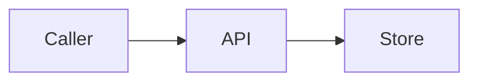

# Design doc: <name>

*One paragraph. Who calls this, what they do, and what is out of scope.*

## Functional requirements

*Observable behavior, including what a retry and a duplicate write return.*

- 

## Non-functional requirements

*Each target has a number, a unit, and a condition.*

| Target | Value | Condition |
|---|---|---|
| Latency | | |
| Durability / RPO | | |
| Availability / RTO | | |
| Consistency | | |
| Tenancy isolation | | |
| Retention | | |
| Residency | | |

## Estimates

*Show the arithmetic. Mark each input as given or assumed. Use [capacity-estimate.md](capacity-estimate.md).*

## Component sketch

*For each box: what it owns, and what it explicitly does not own.*

## Data model

| Entity | Key | Store | Source of truth? | Consistency |
|---|---|---|---|---|
| | | | | |

## API

| Operation | Caller | Idempotency | Error a client may retry |
|---|---|---|---|
| | | | |

## Tradeoffs

| Choice | Alternative rejected | Cost you accept |
|---|---|---|
| | | |

## Operability

*Owner, SLO link, what pages, how to roll back, what a bad deploy does.*

## Open questions

*Facts that would change the shape of the design. Label assumptions you proceeded with.*
