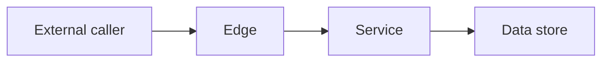

# Threat model: <name>

*Link the design doc. Date it. Name the author.*

## Trust boundaries

*List the boundaries this model actually walks. Delete rows that do not exist.*

| Boundary | From | To |
|---|---|---|
| User to edge | Browser or partner | Gateway |
| Tenant to tenant | Tenant A data | Tenant B data |
| Service to store | Workload | Database or bucket |
| Operator to production | Human admin | Admin API or shell |
| CI to production | Pipeline | Deploy and secrets |

## Diagram

## Abuses

*One row per real abuse. STRIDE is a prompt: spoofing, tampering, repudiation, information disclosure, denial of service, elevation of privilege. Skip letters that do not apply to that flow.*

| Id | Boundary | STRIDE | Abuse | Mitigation or accepted risk | ASVS chapter or "n/a" |
|---|---|---|---|---|---|
| T1 | | | | | |

*ASVS chapters are names from version 5.0.0, not invented requirement ids. See [the chapter map](../enterprise/security/owasp-asvs.md).*

## Open items

*Anything mitigated only by "we will be careful." These block release if the harm is cross-tenant disclosure or silent loss of promised data.*

## Accepted risks

| Risk | Why accepted | Owner | How we would notice |
|---|---|---|---|
| | | | |
